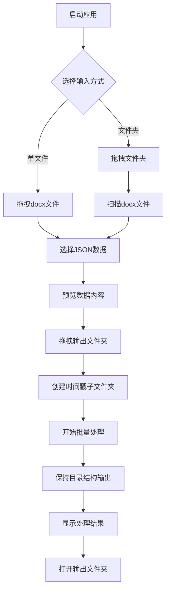

## 1. Product Overview
DocuFiller是一款专为业务团队设计的Word文档批量填充工具，解决手动复制粘贴效率低下和容易出错的问题。
- 通过JSON数据文件自动批量填充Word文档模板中的指定位置，支持对已填充文档进行二次或多次更新。
- 核心解决纯文本替换后元信息丢失的问题，通过Word内容控件的Tag属性实现精确定位和替换。

## 2. Core Features

### 2.1 User Roles
本产品为单机桌面应用，无需用户注册和角色区分，所有用户均可使用全部功能。

### 2.2 Feature Module
我们的Word文档批量填充工具包含以下主要功能模块：
1. **文件输入模块**：支持单文件选择和文件夹拖拽输入，自动扫描docx文件
2. **数据配置模块**：JSON数据文件选择和预览，数据格式验证
3. **输出设置模块**：输出文件夹拖拽选择，自动创建时间戳子文件夹
4. **批量处理模块**：多文档并行处理，实时进度显示和日志记录
5. **结果管理模块**：处理结果统计，输出文件管理和预览

### 2.3 Page Details

| Page Name | Module Name | Feature description |
|-----------|-------------|---------------------|
| 主界面 | 文件输入区域 | 支持拖拽选择单个docx文件或包含docx文件的文件夹，自动扫描子目录中的所有docx文件，显示文件列表和统计信息 |
| 主界面 | 数据配置区域 | 选择JSON数据文件，预览数据内容，验证数据格式，显示字段映射关系 |
| 主界面 | 输出设置区域 | 拖拽选择输出文件夹，自动创建以当前时间命名的子文件夹（格式：年月日时分秒），保持原始目录结构 |
| 主界面 | 处理控制区域 | 开始批量处理，暂停/恢复处理，取消处理，实时显示处理进度和状态 |
| 主界面 | 结果显示区域 | 显示处理结果统计，成功/失败文件列表，错误日志，支持打开输出文件夹 |

## 3. Core Process

用户使用DocuFiller的主要操作流程如下：

**单文件处理流程**：
1. **文件选择阶段**：拖拽单个docx文件到输入区域，或点击浏览按钮选择文件
2. **数据配置阶段**：选择JSON数据文件，系统自动预览数据内容和字段映射
3. **输出设置阶段**：拖拽选择输出文件夹，系统自动创建时间戳子文件夹
4. **处理执行阶段**：点击开始处理，系统处理文档并显示实时进度
5. **结果查看阶段**：查看处理结果统计，打开输出文件夹查看生成文件

**文件夹批量处理流程**：
1. **文件夹选择阶段**：拖拽包含docx文件的文件夹到输入区域
2. **文件扫描阶段**：系统自动递归扫描文件夹，识别所有docx文件并显示文件树
3. **数据配置阶段**：选择JSON数据文件，预览数据内容
4. **输出设置阶段**：拖拽选择输出文件夹，系统创建"年月日时分秒"格式的时间戳子文件夹
5. **批量处理阶段**：系统按原始目录结构批量处理所有docx文件
6. **结果管理阶段**：查看处理统计，管理输出文件，查看错误日志

## 4. User Interface Design
### 4.1 Design Style
- 主色调：深蓝色 (#2C3E50) 和浅蓝色 (#3498DB)
- 辅助色：绿色 (#27AE60) 表示成功，红色 (#E74C3C) 表示错误，橙色 (#E67E22) 表示警告
- 按钮样式：圆角矩形，3D效果，悬停时颜色加深
- 字体：微软雅黑，标题16px，正文12px
- 布局风格：卡片式布局，选项卡导航
- 图标风格：线性图标，简洁现代
- 拖拽区域：虚线边框，拖拽时高亮显示

### 4.2 Page Design Overview

| Page Name | Module Name | UI Elements |
|-----------|-------------|-------------|
| 主界面 | 文件输入区域 | 大型拖拽区域（虚线边框，拖拽时蓝色高亮），文件/文件夹图标，支持的格式提示文字，文件列表树形控件（显示目录结构），文件统计信息 |
| 主界面 | 数据配置区域 | JSON文件选择按钮，数据预览表格（支持滚动），字段映射显示，数据验证状态指示器（绿色/红色图标） |
| 主界面 | 输出设置区域 | 输出文件夹拖拽区域（虚线边框），时间戳文件夹名称预览，目录结构保持选项，输出路径显示 |
| 主界面 | 处理控制区域 | 开始处理按钮（绿色，大尺寸），暂停/恢复按钮，取消按钮，进度条（蓝色填充），当前处理文件显示 |
| 主界面 | 结果显示区域 | 处理统计卡片（成功/失败数量），结果文件列表，错误日志区域，打开输出文件夹按钮 |

### 4.3 Responsiveness
本产品为桌面应用程序，主要针对Windows平台设计，支持窗口缩放和最小化，最小窗口尺寸为1000x700像素，支持高DPI显示器。拖拽区域在不同窗口尺寸下保持良好的可用性。