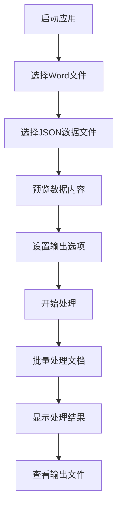

## 1. Product Overview
DocuFiller是一款专为业务团队设计的Word文档批量填充工具，解决手动复制粘贴效率低下和容易出错的问题。
- 通过JSON数据文件自动批量填充Word文档模板中的指定位置，支持对已填充文档进行二次或多次更新。
- 核心解决纯文本替换后元信息丢失的问题，通过Word内容控件的Tag属性实现精确定位和替换。

## 2. Core Features

### 2.1 User Roles
本产品为单用户桌面应用程序，无需用户角色区分。

### 2.2 Feature Module
我们的DocuFiller工具包含以下主要功能模块：
1. **主界面**：文件选择区域、数据预览区域、输出设置区域、执行反馈区域
2. **文件处理引擎**：JSON数据解析、Word文档内容控件识别与替换、批量处理逻辑
3. **错误处理系统**：文件访问异常处理、数据格式验证、日志记录

### 2.3 Page Details

| Page Name | Module Name | Feature description |
|-----------|-------------|---------------------|
| 主界面 | 输入文件选择区域 | 选择Word文件按钮（支持多选.docx文件）、Word文件列表显示、选择JSON数据文件按钮、JSON文件路径显示 |
| 主界面 | 数据预览区域 | 只读文本区域显示JSON文件内容预览，帮助用户确认数据正确性 |
| 主界面 | 输出设置区域 | 选择输出目录按钮、文件命名规则选项（添加后缀或覆盖原文件）、覆盖原文件警告提示 |
| 主界面 | 执行反馈区域 | 开始处理按钮、进度条显示批量处理进度、状态日志输出框实时显示处理信息和错误警告 |
| 文件处理引擎 | JSON数据解析 | 读取和解析JSON文件为键值对集合、JSON格式验证和错误处理 |
| 文件处理引擎 | Word文档处理 | 打开Word文档、遍历内容控件、获取Tag属性、匹配JSON键值对、替换内容、保存文档 |
| 文件处理引擎 | 批量处理逻辑 | 逐一处理Word文档列表、创建文件副本、确定输出路径、错误跳过机制 |

## 3. Core Process

用户操作流程：
1. 启动应用程序，进入主界面
2. 在输入文件选择区域，点击"选择Word文件"按钮，选择一个或多个.docx模板文件
3. 点击"选择数据文件"按钮，选择包含填充数据的JSON文件
4. 在数据预览区域查看JSON文件内容，确认数据正确性
5. 在输出设置区域，选择输出目录和文件命名规则
6. 点击"开始处理"按钮，启动批量填充任务
7. 通过进度条和日志输出框监控处理进度和结果
8. 处理完成后，在指定输出目录查看生成的文件

## 4. User Interface Design

### 4.1 Design Style
- 主色调：#2E86AB（蓝色）和#A23B72（紫红色）
- 按钮样式：圆角矩形按钮，3D效果
- 字体：微软雅黑，主要文字14px，标题16px
- 布局风格：垂直分区布局，每个功能区域用分组框包围
- 图标风格：简洁的线条图标，配合功能按钮使用

### 4.2 Page Design Overview

| Page Name | Module Name | UI Elements |
|-----------|-------------|-------------|
| 主界面 | 输入文件选择区域 | 分组框标题"文件选择"，蓝色按钮"选择Word文件"，列表框显示文件路径，蓝色按钮"选择数据文件"，单行文本框显示JSON路径 |
| 主界面 | 数据预览区域 | 分组框标题"数据预览"，多行只读文本框，白色背景，灰色边框，垂直滚动条 |
| 主界面 | 输出设置区域 | 分组框标题"输出设置"，蓝色按钮"选择输出目录"，单行文本框显示目录路径，单选按钮组选择命名规则，红色警告文字 |
| 主界面 | 执行反馈区域 | 分组框标题"执行状态"，绿色大按钮"开始处理"，蓝色进度条，多行只读文本框显示日志，自动滚动到底部 |

### 4.3 Responsiveness
桌面应用程序，固定窗口大小800x600像素，不考虑响应式设计和触摸交互优化。