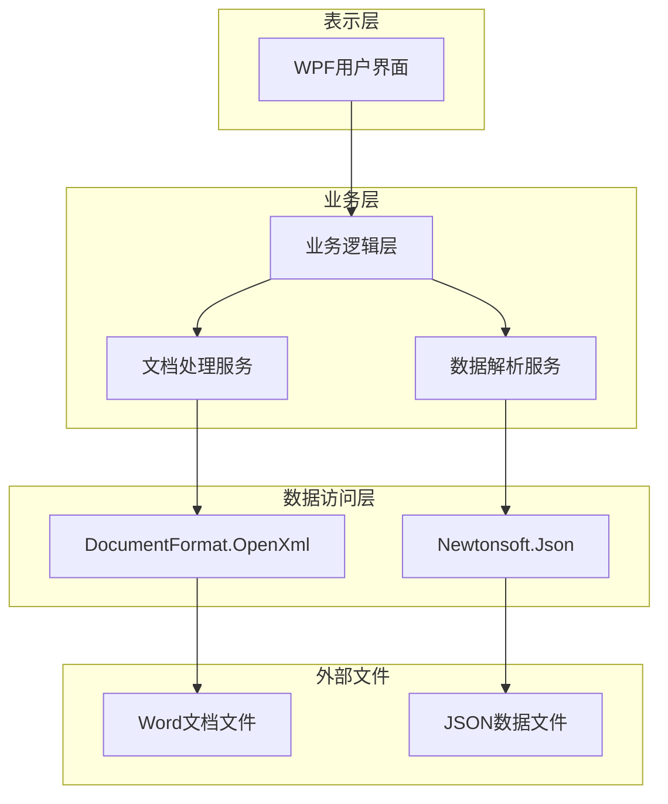
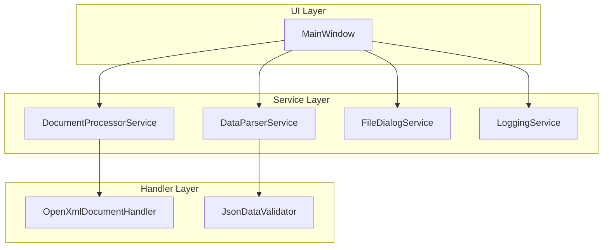
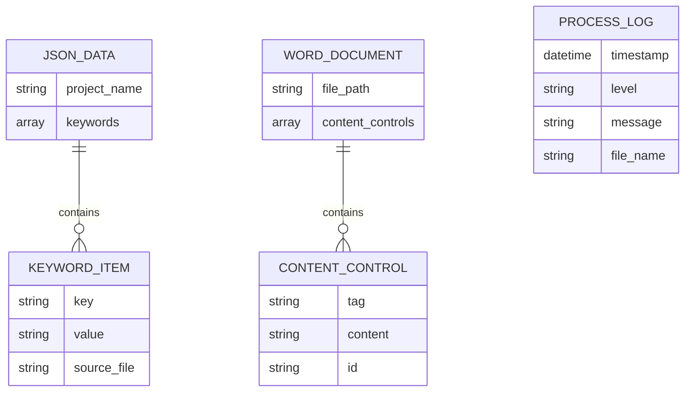

## 1. Architecture design



## 2. Technology Description

* Frontend: WPF (Windows Presentation Foundation) + .NET 8

* Core Libraries: DocumentFormat.OpenXml\@3.0 + Newtonsoft.Json\@13.0

* Build Tool: Visual Studio 2022 + MSBuild

* Packaging: Self-contained deployment

## 3. Route definitions

本项目为桌面应用程序，不涉及路由概念。主要界面组件包括：

| Component           | Purpose                |
| ------------------- | ---------------------- |
| MainWindow          | 主窗口，包含所有功能区域的容器        |
| FileSelectionPanel  | 文件选择面板，处理Word和JSON文件选择 |
| DataPreviewPanel    | 数据预览面板，显示JSON文件内容      |
| OutputSettingsPanel | 输出设置面板，配置输出目录和命名规则     |
| ProcessingPanel     | 处理面板，显示进度和日志信息         |

## 4. API definitions

### 4.1 Core API

文档处理服务接口

```csharp
public interface IDocumentProcessor
{
    Task<ProcessResult> ProcessDocumentsAsync(ProcessRequest request);
    event EventHandler<ProgressEventArgs> ProgressChanged;
    event EventHandler<LogEventArgs> LogMessage;
}
```

数据解析服务接口

```csharp
public interface IDataParser
{
    Dictionary<string, string> ParseJsonData(string jsonFilePath);
    bool ValidateJsonFormat(string jsonContent);
}
```

### 4.2 Data Transfer Objects

处理请求对象

```csharp
public class ProcessRequest
{
    public List<string> WordFilePaths { get; set; }
    public string JsonFilePath { get; set; }
    public string OutputDirectory { get; set; }
    public OutputNamingRule NamingRule { get; set; }
    public bool OverwriteOriginal { get; set; }
}
```

处理结果对象

```csharp
public class ProcessResult
{
    public bool Success { get; set; }
    public int ProcessedFiles { get; set; }
    public int FailedFiles { get; set; }
    public List<string> ErrorMessages { get; set; }
    public List<string> OutputFilePaths { get; set; }
}
```

进度事件参数

```csharp
public class ProgressEventArgs : EventArgs
{
    public int CurrentFile { get; set; }
    public int TotalFiles { get; set; }
    public string CurrentFileName { get; set; }
    public double ProgressPercentage { get; set; }
}
```

## 5. Server architecture diagram



## 6. Data model

### 6.1 Data model definition



### 6.2 Data Definition Language

由于本项目不使用数据库，数据模型主要体现在内存中的对象结构和文件格式定义：

JSON数据文件格式

```json
{
  "project_name": "项目名称",
  "keywords": [
    {
      "key": "#占位符标识#",
      "value": "要填充的具体内容",
      "source_file": "数据来源文件名"
    }
  ]
}
```

Word文档内容控件要求

* 使用Word开发工具选项卡中的"富文本内容控件"

* 每个内容控件必须设置唯一的Tag属性

* Tag属性值与JSON数据中的key字段对应

* 支持纯文本内容控件和富文本内容控件

配置文件格式（可选）

```json
{
  "default_output_directory": "C:\\Output",
  "default_naming_rule": "add_suffix",
  "log_level": "Info",
  "max_log_entries": 1000
}
```

