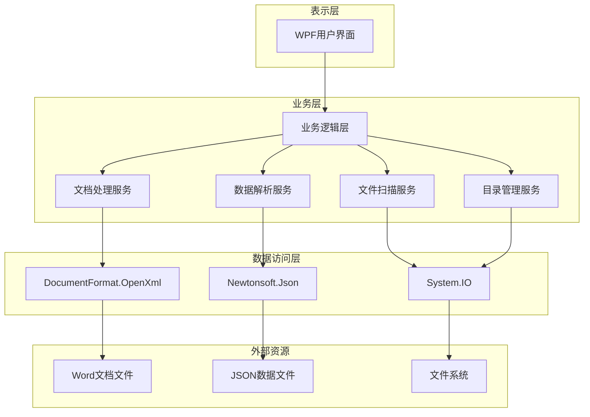
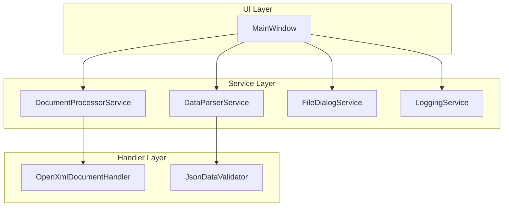
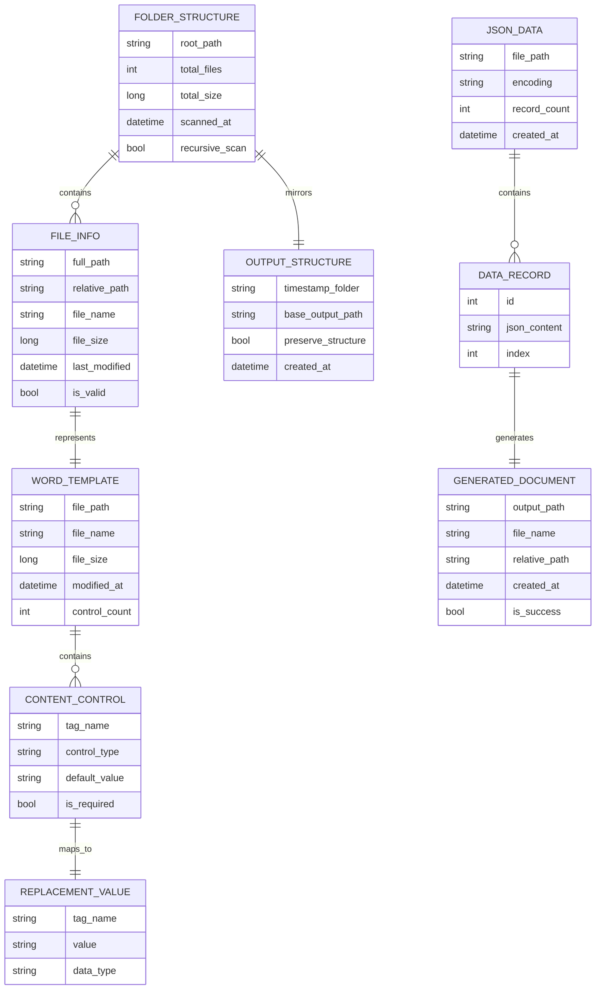

## 1. Architecture design



## 2. Technology Description

* Frontend: WPF (Windows Presentation Foundation) + .NET 8

* Core Libraries: DocumentFormat.OpenXml@3.0 + Newtonsoft.Json@13.0 + System.IO.FileSystem

* UI Framework: WPF拖拽支持 + TreeView控件 + 异步处理

* Build Tool: Visual Studio 2022 + MSBuild

* Packaging: Self-contained deployment

## 3. Route definitions

本项目为桌面应用程序，不涉及路由概念。主要界面组件包括：

| Component           | Purpose                |
| ------------------- | ---------------------- |
| MainWindow          | 主窗口，包含所有功能区域的容器        |
| FileSelectionPanel  | 文件选择面板，处理Word和JSON文件选择 |
| DataPreviewPanel    | 数据预览面板，显示JSON文件内容      |
| OutputSettingsPanel | 输出设置面板，配置输出目录和命名规则     |
| ProcessingPanel     | 处理面板，显示进度和日志信息         |

## 4. API definitions

### 4.1 Core API

文档处理服务接口

```csharp
public interface IDocumentProcessor
{
    Task<ProcessResult> ProcessDocumentsAsync(ProcessRequest request);
    Task<ProcessResult> ProcessFolderAsync(FolderProcessRequest request);
    Task<ValidationResult> ValidateTemplateAsync(string templatePath);
    Task<List<ContentControlData>> GetContentControlsAsync(string templatePath);
    void CancelProcessing();
    event EventHandler<ProgressEventArgs> ProgressUpdated;
}
```

数据解析服务接口

```csharp
public interface IDataParser
{
    Task<List<Dictionary<string, object>>> ParseJsonFileAsync(string jsonFilePath);
    Task<DataStatistics> GetDataStatisticsAsync(string jsonFilePath);
    Task<List<Dictionary<string, object>>> GetDataPreviewAsync(string jsonFilePath, int maxRecords);
    bool ValidateJsonFormat(string jsonContent);
}
```

文件扫描服务接口

```csharp
public interface IFileScanner
{
    Task<List<FileInfo>> ScanDocxFilesAsync(string folderPath, bool recursive = true);
    Task<FolderStructure> GetFolderStructureAsync(string folderPath);
    bool IsValidDocxFile(string filePath);
}
```

目录管理服务接口

```csharp
public interface IDirectoryManager
{
    string CreateTimestampFolder(string basePath);
    Task<bool> PreserveFolderStructureAsync(string sourcePath, string targetPath, List<FileInfo> files);
    string GetRelativePath(string basePath, string fullPath);
}
```

### 4.2 Data Transfer Objects

处理请求对象

```csharp
public class ProcessRequest
{
    public string TemplateFilePath { get; set; }
    public string DataFilePath { get; set; }
    public string OutputDirectory { get; set; }
    public string OutputFileNamePattern { get; set; }
    public bool OverwriteExisting { get; set; }
}
```

文件夹处理请求对象

```csharp
public class FolderProcessRequest
{
    public string SourceFolderPath { get; set; }
    public string DataFilePath { get; set; }
    public string OutputDirectory { get; set; }
    public bool PreserveStructure { get; set; }
    public bool CreateTimestampFolder { get; set; }
    public bool RecursiveScan { get; set; }
}
```

处理结果对象

```csharp
public class ProcessResult
{
    public bool IsSuccess { get; set; }
    public int TotalRecords { get; set; }
    public int SuccessfulRecords { get; set; }
    public int FailedRecords { get; set; }
    public List<string> Errors { get; set; }
    public List<string> Warnings { get; set; }
    public List<string> GeneratedFiles { get; set; }
    public DateTime StartTime { get; set; }
    public DateTime EndTime { get; set; }
    public TimeSpan Duration { get; set; }
    public string Message { get; set; }
}
```

文件信息对象

```csharp
public class FileInfo
{
    public string FullPath { get; set; }
    public string RelativePath { get; set; }
    public string FileName { get; set; }
    public long FileSize { get; set; }
    public DateTime LastModified { get; set; }
    public bool IsValid { get; set; }
}
```

文件夹结构对象

```csharp
public class FolderStructure
{
    public string RootPath { get; set; }
    public List<FileInfo> DocxFiles { get; set; }
    public Dictionary<string, List<FileInfo>> FolderFiles { get; set; }
    public int TotalFiles { get; set; }
    public long TotalSize { get; set; }
}
```

进度事件参数

```csharp
public class ProgressEventArgs : EventArgs
{
    public int CurrentItem { get; set; }
    public int TotalItems { get; set; }
    public string StatusMessage { get; set; }
    public string CurrentFileName { get; set; }
    public double ProgressPercentage { get; set; }
    public bool IsCompleted { get; set; }
    public bool HasError { get; set; }
}
```

## 5. Server architecture diagram



## 6. Data model

### 6.1 Data model definition



### 6.2 Data Definition Language

由于本项目不使用数据库，数据模型主要体现在内存中的对象结构和文件格式定义：

JSON数据文件格式

```json
{
  "project_name": "项目名称",
  "keywords": [
    {
      "key": "#占位符标识#",
      "value": "要填充的具体内容",
      "source_file": "数据来源文件名"
    }
  ]
}
```

Word文档内容控件要求

* 使用Word开发工具选项卡中的"富文本内容控件"

* 每个内容控件必须设置唯一的Tag属性

* Tag属性值与JSON数据中的key字段对应

* 支持纯文本内容控件和富文本内容控件

配置文件格式（可选）

```json
{
  "default_output_directory": "C:\\Output",
  "default_naming_rule": "add_suffix",
  "log_level": "Info",
  "max_log_entries": 1000
}
```

