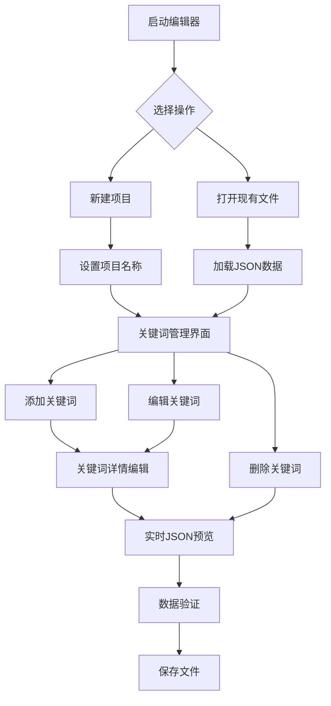

## 1. 产品概述

JSON关键词编辑器是一个独立的桌面应用功能模块，专门用于创建和编辑用于文档模板替换的关键词数据文件。
- 该工具提供可视化的界面来管理关键词数据，支持项目级别的关键词组织和管理，简化JSON数据文件的创建和维护工作。
- 目标是为文档处理工作流提供高效的关键词数据准备工具，提升用户的数据管理效率。

## 2. 核心功能

### 2.1 用户角色
本产品为单用户桌面应用，无需区分用户角色。

### 2.2 功能模块

我们的JSON关键词编辑器包含以下主要页面：
1. **主编辑窗口**：项目信息设置、关键词列表管理、实时JSON预览
2. **文件操作界面**：新建、打开、保存、另存为功能
3. **关键词编辑界面**：单个关键词的详细编辑功能

### 2.3 页面详情

| 页面名称 | 模块名称 | 功能描述 |
|---------|---------|----------|
| 主编辑窗口 | 项目信息区 | 设置和编辑项目名称，显示当前编辑的项目基本信息 |
| 主编辑窗口 | 关键词列表区 | 显示所有关键词的列表，支持添加、删除、编辑、排序操作 |
| 主编辑窗口 | JSON预览区 | 实时显示当前数据的JSON格式预览，支持格式化和验证 |
| 主编辑窗口 | 工具栏 | 提供文件操作按钮（新建、打开、保存、另存为）和编辑操作按钮 |
| 关键词编辑界面 | 关键词详情表单 | 编辑单个关键词的key、value、source_file字段，支持多行文本编辑 |
| 关键词编辑界面 | 预览区域 | 显示当前编辑关键词的格式化预览 |
| 文件操作界面 | 文件浏览器 | 支持文件选择、拖拽打开、最近文件列表功能 |

## 3. 核心流程

**主要用户操作流程：**

1. **新建项目流程**：用户启动编辑器 → 点击新建 → 设置项目名称 → 添加关键词 → 保存文件
2. **编辑现有项目流程**：用户启动编辑器 → 打开现有JSON文件 → 编辑项目信息和关键词 → 保存更改
3. **关键词管理流程**：在关键词列表中选择项目 → 添加/编辑/删除关键词 → 实时查看JSON预览 → 验证数据格式

## 4. 用户界面设计

### 4.1 设计风格

- **主色调**：主色 #2C3E50（深蓝灰），辅助色 #3498DB（蓝色）
- **按钮样式**：现代扁平化设计，圆角按钮，悬停效果
- **字体**：微软雅黑，主要字号14px，标题字号16-18px
- **布局风格**：左右分栏布局，卡片式组件设计
- **图标风格**：使用简洁的线性图标，支持文件、编辑、保存等操作图标

### 4.2 页面设计概览

| 页面名称 | 模块名称 | UI元素 |
|---------|---------|--------|
| 主编辑窗口 | 工具栏 | 扁平化按钮组，图标+文字，背景色#ECF0F1，按钮间距10px |
| 主编辑窗口 | 项目信息区 | 白色卡片背景，标题字体16px加粗，输入框边框#BDC3C7 |
| 主编辑窗口 | 关键词列表区 | DataGrid样式，表头背景#34495E白色文字，行高32px，交替行背景#F8F9FA |
| 主编辑窗口 | JSON预览区 | 等宽字体Consolas，背景#2C3E50，文字#ECF0F1，语法高亮显示 |
| 关键词编辑界面 | 编辑表单 | 标签宽度120px，输入框圆角4px，多行文本框最小高度80px |
| 关键词编辑界面 | 按钮区域 | 主按钮#3498DB，次要按钮#95A5A6，按钮高度36px |

### 4.3 响应式设计

桌面优先设计，最小窗口尺寸1200x800px，支持窗口缩放和分栏比例调整，左右分栏可拖拽调整宽度比例。