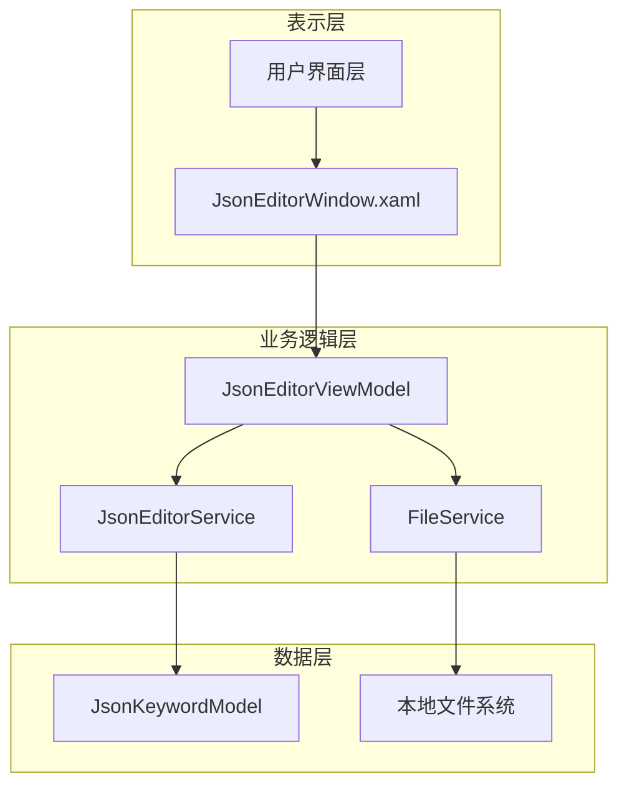
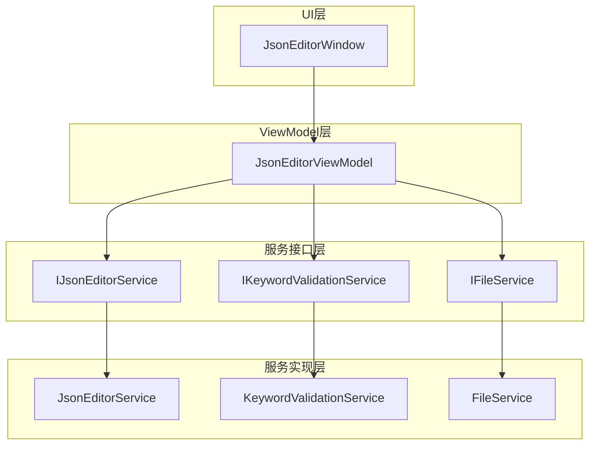
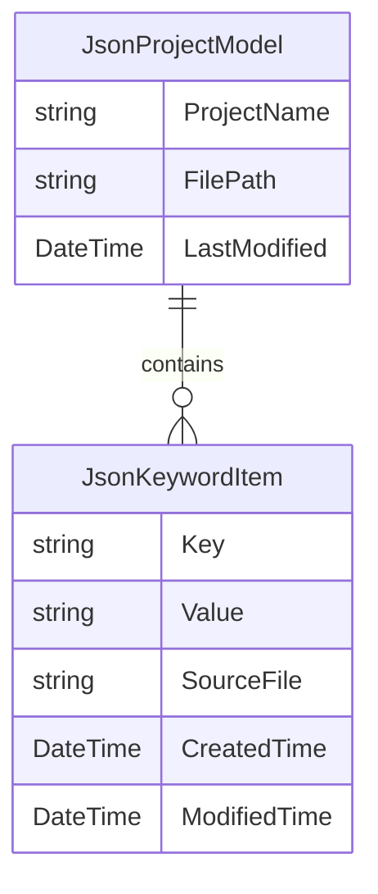

## 1. 架构设计



## 2. 技术描述

- 前端：WPF + XAML + MVVM模式
- 框架：.NET 7
- JSON处理：Newtonsoft.Json
- 依赖注入：Microsoft.Extensions.DependencyInjection
- 日志：Microsoft.Extensions.Logging

## 3. 路由定义

| 窗口/页面 | 用途 |
|----------|------|
| JsonEditorWindow | JSON关键词编辑器主窗口，提供完整的编辑功能 |
| KeywordEditDialog | 关键词详细编辑对话框，用于单个关键词的编辑 |
| FileOperationDialog | 文件操作对话框，处理文件保存确认等操作 |

## 4. API定义

### 4.1 核心服务接口

**IJsonEditorService - JSON编辑服务**
```csharp
public interface IJsonEditorService
{
    Task<JsonProjectModel> LoadProjectAsync(string filePath);
    Task<bool> SaveProjectAsync(JsonProjectModel project, string filePath);
    ValidationResult ValidateProject(JsonProjectModel project);
    string FormatJsonString(JsonProjectModel project);
}
```

**IKeywordValidationService - 关键词验证服务**
```csharp
public interface IKeywordValidationService
{
    ValidationResult ValidateKeyword(JsonKeywordItem keyword);
    ValidationResult ValidateKeywordList(List<JsonKeywordItem> keywords);
    bool IsKeywordDuplicate(string key, List<JsonKeywordItem> keywords);
}
```

### 4.2 数据模型定义

**JsonProjectModel - 项目数据模型**
```csharp
public class JsonProjectModel
{
    public string ProjectName { get; set; }
    public List<JsonKeywordItem> Keywords { get; set; }
    public DateTime LastModified { get; set; }
    public string FilePath { get; set; }
}
```

**JsonKeywordItem - 关键词数据模型**
```csharp
public class JsonKeywordItem
{
    public string Key { get; set; }
    public string Value { get; set; }
    public string SourceFile { get; set; }
    public DateTime CreatedTime { get; set; }
    public DateTime ModifiedTime { get; set; }
}
```

**ValidationResult - 验证结果模型**
```csharp
public class ValidationResult
{
    public bool IsValid { get; set; }
    public List<string> Errors { get; set; }
    public List<string> Warnings { get; set; }
}
```

## 5. 服务架构图



## 6. 数据模型

### 6.1 数据模型定义



### 6.2 JSON数据结构定义

**标准JSON格式**
```json
{
  "project_name": "项目名称",
  "keywords": [
    {
      "key": "#关键词#",
      "value": "替换值\n支持多行文本\n第三行内容",
      "source_file": "来源文件名"
    }
  ]
}
```

**数据验证规则**
- project_name: 必填，长度1-100字符
- keywords: 必填数组，至少包含1个元素
- key: 必填，唯一性验证，建议使用#包围格式
- value: 必填，支持多行文本，最大长度10000字符
- source_file: 可选，长度0-200字符

**文件操作规范**
- 文件扩展名：.json
- 编码格式：UTF-8
- 换行符：Windows CRLF (\r\n)
- 缩进：2个空格
- 自动备份：保存时创建.bak备份文件