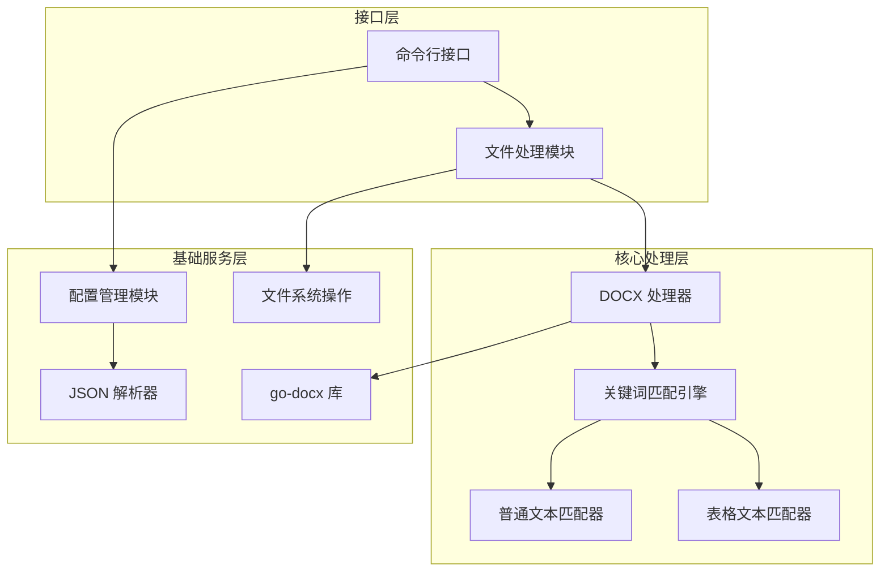
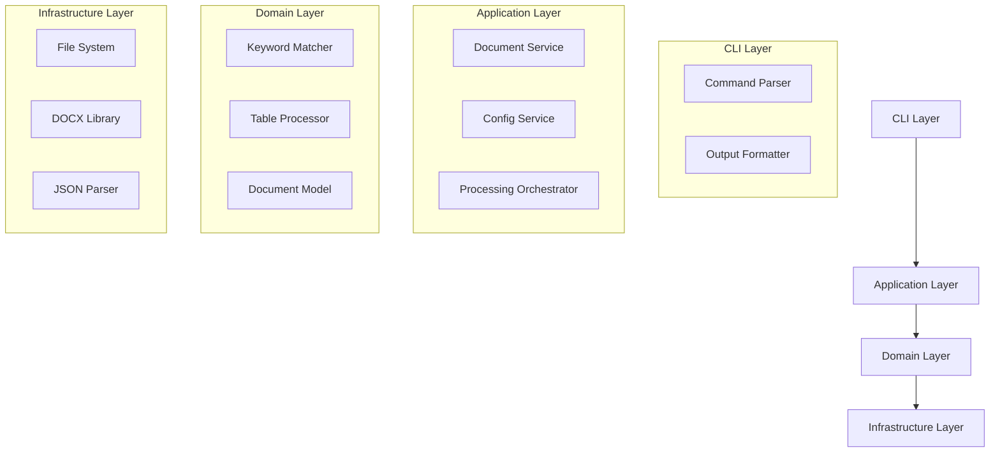
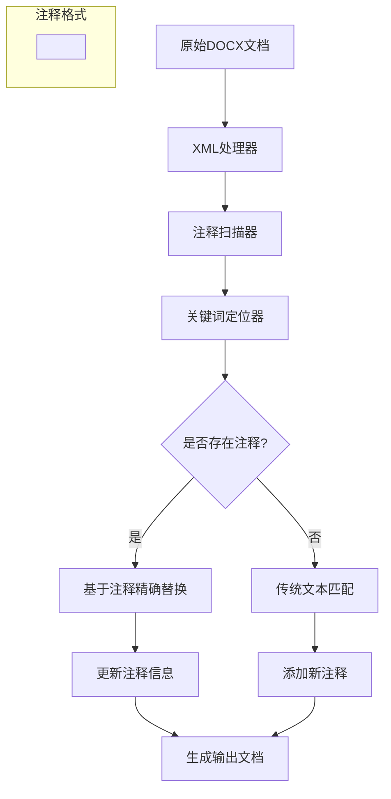
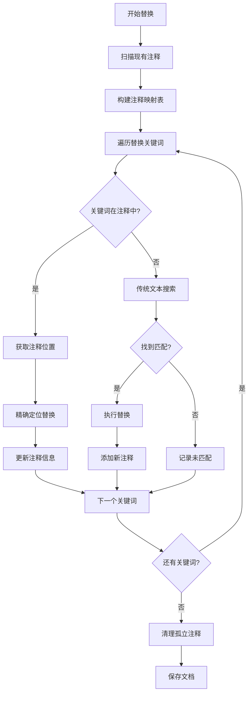
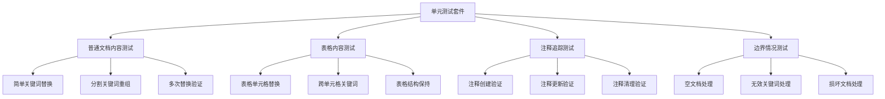

# DOCX 文档关键词替换工具技术架构文档

## 1. Architecture design



## 2.Technology Description

- Core: Go@1.21+ (命令行工具)
- XML Processing: archive/zip (内置DOCX处理)
- Configuration: encoding/json (JSON配置文件)
- Comment Tracking: 自定义Word注释解析器 (默认启用)
- Testing: testing (Go内置测试框架)
- Test Data: 测试用DOCX文件和表格样本

## 3.核心模块定义

| 模块 | 功能描述 |
|------|----------|
| XMLProcessor | DOCX文件的ZIP结构处理和XML内容操作 |
| CommentManager | Word注释的读取、写入和管理 |
| ConfigManager | JSON配置文件的加载、验证和解析 |
| KeywordMatcher | 关键词匹配和替换逻辑 |
| ReplacementTracker | 替换历史和统计信息管理 |

## 4. API definitions

### 4.1 Core API

#### 配置管理接口
```go
type Keyword struct {
    Key        string `json:"key"`
    Value      string `json:"value"`
    SourceFile string `json:"source_file"`
}

// 用户数据配置（A.json）
type UserConfig struct {
    ProjectName string    `json:"project_name"`
    Keywords    []Keyword `json:"keywords"`
}

// 应用程序配置（可选的独立配置文件）
type AppConfig struct {
    CommentTracking CommentConfig `json:"comment_tracking"`
    Processing      ProcessConfig `json:"processing"`
}

// 运行时配置（合并用户配置和应用配置）
type RuntimeConfig struct {
    UserConfig *UserConfig
    AppConfig  *AppConfig
    CLIFlags   *CLIFlags
}

type CLIFlags struct {
    EnableCommentTracking bool
    ConfigFile           string
    VerboseOutput        bool
    BackupOriginal       bool
}

type ConfigManager interface {
    LoadUserConfig(filePath string) (*UserConfig, error)
    LoadAppConfig(filePath string) (*AppConfig, error)
    MergeConfigs(userConfig *UserConfig, appConfig *AppConfig, cliFlags *CLIFlags) *RuntimeConfig
    ValidateUserConfig(config *UserConfig) error
    GetKeywordMap(config *UserConfig) map[string]string
}
```

#### 文档处理接口
```go
type DocumentProcessor interface {
    ProcessFile(inputPath, outputPath string, config *RuntimeConfig) error
    ProcessFolder(inputDir, outputDir string, config *RuntimeConfig) (*ProcessResult, error)
}

type ProcessResult struct {
    TotalFiles    int
    ProcessedFiles int
    FailedFiles   []string
    Duration      time.Duration
}
```

#### 关键词匹配接口
```go
type KeywordMatcher interface {
    FindKeywords(content string) []KeywordMatch
    ReplaceKeywords(content string, replacements map[string]string) string
}

type KeywordMatch struct {
    Keyword   string
    Position  int
    Length    int
    IsSplit   bool
}
```

#### 表格处理接口
```go
type TableProcessor interface {
    ProcessTableCells(cells []string, replacements map[string]string) []string
    ReconstructSplitKeywords(xmlContent string) string
}
```

## 5. Server architecture diagram



## 6.注释追踪机制设计

### 6.1 隐藏注释标记法架构



### 6.2 核心组件设计

#### 注释管理器 (CommentManager)
```go
type CommentManager struct {
    comments map[string]*ReplacementComment
    enabled  bool
}

type ReplacementComment struct {
    OriginalKeyword string
    LastValue      string
    ReplaceCount   int
    LastModified   time.Time
    Position       CommentPosition
}

type CommentPosition struct {
    NodeID    string
    StartPos  int
    EndPos    int
}
```

#### 增强的XML处理器
```go
type EnhancedXMLProcessor struct {
    *XMLProcessor
    commentManager *CommentManager
    config         *CommentConfig
}

type CommentConfig struct {
    EnableCommentTracking   bool   `json:"enable_comment_tracking"`
    CleanupOrphanedComments bool   `json:"cleanup_orphaned_comments"`
    CommentFormat          string `json:"comment_format"`
    MaxCommentHistory      int    `json:"max_comment_history"`
}

// 应用程序配置（独立于用户数据）
type AppConfig struct {
    CommentTracking CommentConfig `json:"comment_tracking"`
    Processing      ProcessConfig `json:"processing"`
}

type ProcessConfig struct {
    BackupOriginal     bool `json:"backup_original"`
    VerboseOutput      bool `json:"verbose_output"`
    ParallelProcessing bool `json:"parallel_processing"`
}
```

### 6.3 替换算法流程



### 6.4 配置扩展

#### 用户数据文件（A.json）- 保持不变
```json
{
  "project_name": "凝血项目",
  "keywords": [
    {
      "key": "产品名称",
      "value": "D-二聚体测定试剂盒（胶乳免疫比浊法）",
      "source_file": "5.2说明书"
    },
    {
      "key": "结构及组成",
      "value": "adsasdadsa",
      "source_file": "请输入源文asdasd件"
    }
  ]
}
```

#### 独立配置文件（docx-replacer-config.json）- 可选
```json
{
  "comment_tracking": {
    "enable_comment_tracking": true,
    "cleanup_orphaned_comments": false,
    "comment_format": "DOCX_REPLACER_ORIGINAL",
    "max_comment_history": 10
  },
  "processing": {
    "backup_original": true,
    "verbose_output": false,
    "parallel_processing": true
  }
}
```

#### 命令行参数配置
```bash
# 基本使用（注释追踪强制启用）
docx-replacer input.docx config.json

# 指定独立配置文件
docx-replacer --config=docx-replacer-config.json input.docx data.json

# 详细输出模式
docx-replacer --verbose input.docx config.json

# 备份原文件
docx-replacer --backup input.docx config.json
```
```

### 6.5 向后兼容性保证

#### 兼容性策略
1. **用户数据文件不变**: A.json文件格式完全保持不变，确保外部编辑器兼容性
2. **统一替换模式**: 注释追踪功能强制启用，移除传统文本匹配替换
3. **智能回退**: 当注释不可用时，使用增强的文本匹配算法
4. **配置分离**: 应用程序配置与用户数据完全分离，避免冲突
5. **向后兼容**: 自动处理没有注释的旧文档

#### 配置加载优先级
1. **命令行参数** (最高优先级)
2. **独立配置文件** (docx-replacer-config.json)
3. **默认配置** (注释追踪强制启用)

#### 配置文件查找顺序
```go
// 配置文件查找逻辑
func (cm *ConfigManager) FindAppConfig() string {
    // 1. 命令行指定的配置文件
    if cm.cliFlags.ConfigFile != "" {
        return cm.cliFlags.ConfigFile
    }
    
    // 2. 当前目录下的配置文件
    if exists("docx-replacer-config.json") {
        return "docx-replacer-config.json"
    }
    
    // 3. 用户主目录下的配置文件
    homeConfig := filepath.Join(os.Getenv("HOME"), ".docx-replacer-config.json")
    if exists(homeConfig) {
        return homeConfig
    }
    
    // 4. 使用默认配置
    return ""
}
```

#### 错误处理机制
```go
type ReplacementResult struct {
    Success           bool
    ReplacedCount     int
    CommentBasedCount int
    TraditionalCount  int
    FailedKeywords    []string
    Warnings          []string
}
```

### 6.6 Data Definition Language

#### 用户数据文件结构 (A.json) - 保持不变
```json
{
  "project_name": "凝血项目",
  "keywords": [
    {
      "key": "产品名称",
      "value": "D-二聚体测定试剂盒（胶乳免疫比浊法）",
      "source_file": "5.2说明书"
    },
    {
      "key": "结构及组成",
      "value": "adsasdadsa",
      "source_file": "请输入源文asdasd件"
    }
  ]
}
```

#### 应用程序配置文件结构 (docx-replacer-config.json) - 可选
```json
{
  "comment_tracking": {
    "enable_comment_tracking": true,
    "cleanup_orphaned_comments": false,
    "comment_format": "DOCX_REPLACER_ORIGINAL",
    "max_comment_history": 10
  },
  "processing": {
    "backup_original": true,
    "verbose_output": false,
    "parallel_processing": true
  }
}
```

#### Go 结构体定义
```go
// 关键词结构
type Keyword struct {
    Key        string `json:"key"`
    Value      string `json:"value"`
    SourceFile string `json:"source_file"`
}

// 用户数据配置结构（A.json）
type UserConfig struct {
    ProjectName string    `json:"project_name"`
    Keywords    []Keyword `json:"keywords"`
}

// 注释追踪配置
type CommentConfig struct {
    EnableCommentTracking   bool   `json:"enable_comment_tracking"`
    CleanupOrphanedComments bool   `json:"cleanup_orphaned_comments"`
    CommentFormat          string `json:"comment_format"`
    MaxCommentHistory      int    `json:"max_comment_history"`
}

// 处理配置
type ProcessConfig struct {
    BackupOriginal     bool `json:"backup_original"`
    VerboseOutput      bool `json:"verbose_output"`
    ParallelProcessing bool `json:"parallel_processing"`
}

// 应用程序配置结构（docx-replacer-config.json）
type AppConfig struct {
    CommentTracking CommentConfig `json:"comment_tracking"`
    Processing      ProcessConfig `json:"processing"`
}

// 命令行标志
type CLIFlags struct {
    ConfigFile     string
    VerboseOutput  bool
    BackupOriginal bool
    TestMode       bool  // 用于单元测试
}

// 运行时配置（合并所有配置源）
type RuntimeConfig struct {
    UserConfig *UserConfig
    AppConfig  *AppConfig
    CLIFlags   *CLIFlags
}

// 文档处理结果
type ProcessResult struct {
    TotalFiles     int           `json:"total_files"`
    ProcessedFiles int           `json:"processed_files"`
    FailedFiles    []string      `json:"failed_files"`
    Duration       time.Duration `json:"duration"`
    Errors         []error       `json:"errors,omitempty"`
}

// 关键词匹配结果
type KeywordMatch struct {
    Keyword     string `json:"keyword"`
    Replacement string `json:"replacement"`
    Position    int    `json:"position"`
    Length      int    `json:"length"`
    IsSplit     bool   `json:"is_split"`
    Context     string `json:"context,omitempty"`
}

// 文档元数据
type DocumentInfo struct {
    FilePath     string    `json:"file_path"`
    FileSize     int64     `json:"file_size"`
    ModTime      time.Time `json:"mod_time"`
    ProcessedAt  time.Time `json:"processed_at"`
    KeywordCount int       `json:"keyword_count"`
}
```

#### 错误处理结构
```go
// 自定义错误类型
type ProcessError struct {
    Type    string `json:"type"`
    Message string `json:"message"`
    File    string `json:"file,omitempty"`
    Details string `json:"details,omitempty"`
}

func (e *ProcessError) Error() string {
    return fmt.Sprintf("%s: %s", e.Type, e.Message)
}
```

## 7. 单元测试架构设计

### 7.1 测试策略概述



### 7.2 普通文档内容测试设计

#### 7.2.1 测试用例分类

| 测试类别 | 测试场景 | 预期结果 |
|----------|----------|----------|
| 基础替换 | 简单关键词替换 | 正确替换并添加注释 |
| 分割关键词 | XML标签分割的关键词 | 重组后正确替换 |
| 多次替换 | 基于注释的重复替换 | 精确定位并更新 |
| 嵌套结构 | 段落、列表中的关键词 | 保持文档结构 |
| 特殊字符 | 包含特殊字符的关键词 | 正确转义和替换 |

#### 7.2.2 测试数据结构

```go
type DocumentTestCase struct {
    Name           string
    InputDocx      string          // 测试用DOCX文件路径
    Keywords       []Keyword       // 替换关键词
    ExpectedResult ExpectedResult  // 预期结果
    TestType       TestType        // 测试类型
}

type ExpectedResult struct {
    ReplacedCount     int
    CommentCount      int
    PreserveStructure bool
    ExpectedContent   map[string]string // 关键词 -> 预期替换后内容
}

type TestType int

const (
    TestTypeBasic TestType = iota
    TestTypeSplitKeyword
    TestTypeMultipleReplace
    TestTypeNestedStructure
    TestTypeSpecialChars
)
```

### 7.3 表格内容测试设计

#### 7.3.1 表格测试特殊性

表格内容替换与普通文档内容替换的主要差异：
1. **XML结构复杂**: 表格使用`<w:tbl>`、`<w:tr>`、`<w:tc>`等复杂嵌套结构
2. **跨单元格关键词**: 关键词可能被表格边界分割
3. **格式保持**: 需要保持表格的格式和布局
4. **注释位置**: 注释需要正确关联到表格单元格

#### 7.3.2 表格测试用例设计

```go
type TableTestCase struct {
    Name          string
    InputTable    TableStructure   // 测试表格结构
    Keywords      []Keyword        // 替换关键词
    ExpectedTable TableStructure   // 预期表格结构
    TestScenario  TableTestType    // 测试场景
}

type TableStructure struct {
    Rows    int
    Cols    int
    Cells   [][]string           // 单元格内容
    Formats [][]CellFormat       // 单元格格式
}

type CellFormat struct {
    Bold      bool
    Italic    bool
    FontSize  int
    FontColor string
}

type TableTestType int

const (
    TableTestSingleCell TableTestType = iota  // 单个单元格内替换
    TableTestCrossCells                       // 跨单元格关键词
    TableTestMultipleRows                     // 多行表格替换
    TableTestFormatPreserve                   // 格式保持测试
    TableTestCommentTracking                  // 表格注释追踪
)
```

#### 7.3.3 表格测试数据生成

```go
// 表格测试数据生成器
type TableTestDataGenerator struct {
    templates map[TableTestType]TableTemplate
}

type TableTemplate struct {
    Name        string
    Description string
    Generator   func() TableTestCase
}

// 生成标准表格测试用例
func (g *TableTestDataGenerator) GenerateStandardCases() []TableTestCase {
    return []TableTestCase{
        {
            Name: "单元格内简单替换",
            InputTable: TableStructure{
                Rows: 2,
                Cols: 2,
                Cells: [][]string{
                    {"产品名称", "规格型号"},
                    {"#产品名称#", "#规格型号#"},
                },
            },
            Keywords: []Keyword{
                {Key: "产品名称", Value: "测试产品", SourceFile: "test.json"},
                {Key: "规格型号", Value: "V1.0", SourceFile: "test.json"},
            },
            TestScenario: TableTestSingleCell,
        },
        {
            Name: "跨单元格关键词重组",
            InputTable: TableStructure{
                Rows: 1,
                Cols: 3,
                Cells: [][]string{
                    {"#产品", "名称", "#测试"},
                },
            },
            Keywords: []Keyword{
                {Key: "产品名称", Value: "新产品", SourceFile: "test.json"},
            },
            TestScenario: TableTestCrossCells,
        },
    }
}
```

### 7.4 注释追踪专项测试

#### 7.4.1 注释生命周期测试

```go
type CommentTrackingTest struct {
    Name           string
    InitialDoc     string              // 初始文档
    ReplacementSeq []ReplacementStep   // 替换步骤序列
    ExpectedComments []ExpectedComment // 预期注释状态
}

type ReplacementStep struct {
    Keywords    []Keyword
    Description string
}

type ExpectedComment struct {
    OriginalKeyword string
    LastValue      string
    ReplaceCount   int
    ShouldExist    bool
}
```

#### 7.4.2 注释追踪测试用例

| 测试场景 | 描述 | 验证点 |
|----------|------|--------|
| 首次替换 | 第一次替换关键词 | 创建正确的注释标记 |
| 二次替换 | 基于注释的精确替换 | 更新注释信息，替换准确 |
| 多次替换 | 连续多次替换验证 | 注释历史记录正确 |
| 注释清理 | 删除孤立注释 | 清理无效注释 |
| 注释恢复 | 基于注释恢复原始关键词 | 反向替换功能 |

### 7.5 边界情况和错误处理测试

#### 7.5.1 边界情况测试矩阵

| 边界情况 | 测试内容 | 预期行为 |
|----------|----------|----------|
| 空文档 | 处理空的DOCX文件 | 优雅处理，不报错 |
| 无关键词 | 文档中无匹配关键词 | 返回未修改文档 |
| 损坏文档 | 处理损坏的DOCX文件 | 返回明确错误信息 |
| 超大文档 | 处理大型文档 | 性能在可接受范围 |
| 特殊字符 | 包含Unicode字符 | 正确处理各种字符 |
| 嵌套表格 | 表格中嵌套表格 | 正确处理嵌套结构 |

#### 7.5.2 性能测试指标

```go
type PerformanceMetrics struct {
    ProcessingTime   time.Duration  // 处理时间
    MemoryUsage     int64          // 内存使用
    FileSize        int64          // 文件大小
    KeywordCount    int            // 关键词数量
    ReplacementCount int           // 替换次数
}

type PerformanceBenchmark struct {
    Name           string
    DocumentSize   DocumentSize    // 文档大小类别
    KeywordCount   int            // 关键词数量
    ExpectedTime   time.Duration  // 预期处理时间
    MaxMemoryUsage int64          // 最大内存使用
}

type DocumentSize int

const (
    SmallDoc  DocumentSize = iota  // < 1MB
    MediumDoc                      // 1-10MB
    LargeDoc                       // > 10MB
)
```

### 7.6 测试执行框架

#### 7.6.1 测试套件组织

```go
// 主测试套件
type DocxReplacerTestSuite struct {
    DocumentTests []DocumentTestCase
    TableTests    []TableTestCase
    CommentTests  []CommentTrackingTest
    BoundaryTests []BoundaryTestCase
    testDataDir   string
    tempDir       string
}

// 测试执行器
type TestExecutor struct {
    processor *DocumentProcessor
    validator *ResultValidator
    reporter  *TestReporter
}

// 结果验证器
type ResultValidator struct {
    xmlParser    *XMLParser
    commentParser *CommentParser
}

// 测试报告器
type TestReporter struct {
    results []TestResult
    metrics PerformanceMetrics
}
```

#### 7.6.2 测试数据管理

```go
// 测试数据管理器
type TestDataManager struct {
    baseDir     string
    templates   map[string]string  // 模板文件路径
    generators  map[string]func() interface{}
}

// 测试文档生成器
func (tdm *TestDataManager) GenerateTestDocuments() error {
    // 生成普通文档测试用例
    if err := tdm.generateDocumentTests(); err != nil {
        return err
    }
    
    // 生成表格测试用例
    if err := tdm.generateTableTests(); err != nil {
        return err
    }
    
    // 生成边界情况测试用例
    if err := tdm.generateBoundaryTests(); err != nil {
        return err
    }
    
    return nil
}
```
```