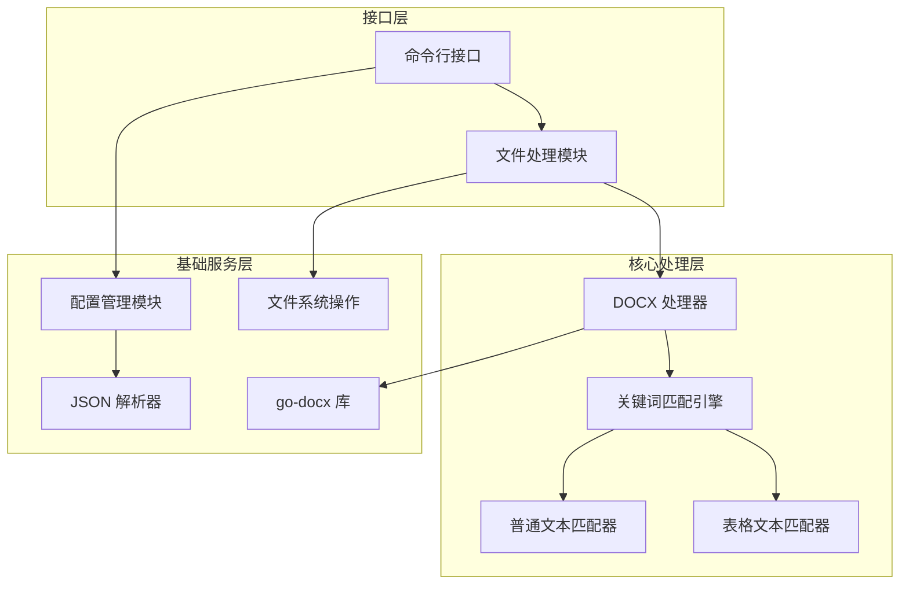
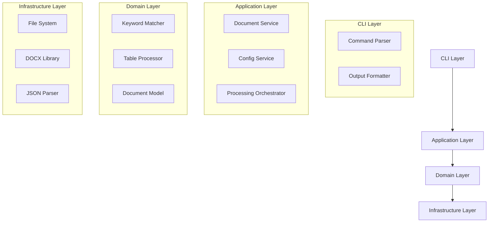
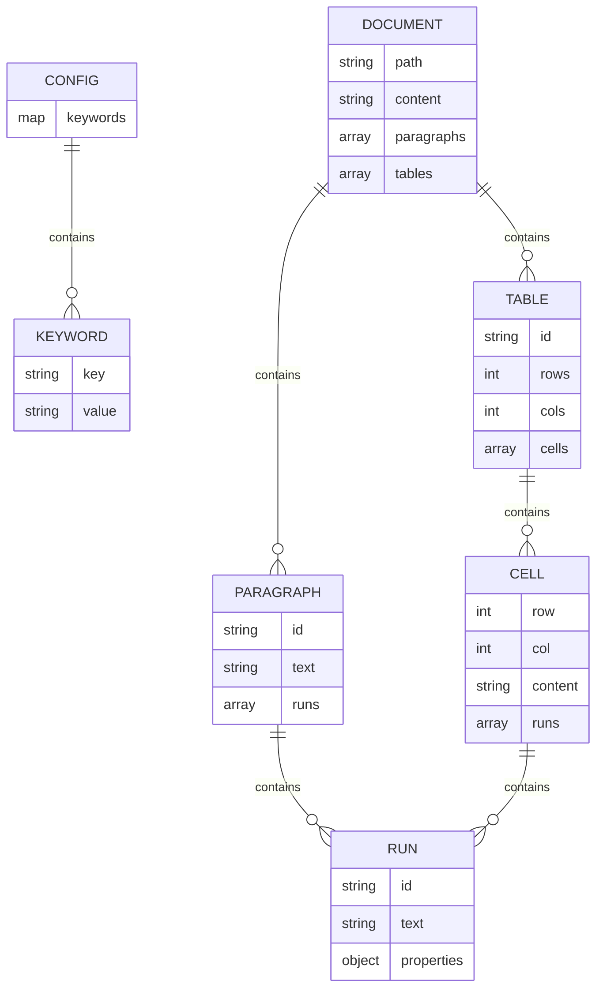

# DOCX 文档关键词替换工具技术架构文档

## 1. Architecture design



## 2. Technology Description

- Frontend: 无（控制台程序）
- Backend: Go@1.23.4 + go-docx@0.5.0
- 依赖库: golang.org/x/net（间接依赖）

## 3. Route definitions

作为控制台程序，无传统路由概念，主要包含以下执行路径：

| 执行路径 | 用途 |
|----------|------|
| main() | 程序入口点，解析命令行参数并启动处理流程 |
| config.Load() | 加载和解析 JSON 配置文件 |
| processor.ProcessFolder() | 批量处理文件夹中的 DOCX 文件 |
| replacer.ReplaceKeywords() | 执行关键词替换操作 |
| matcher.FindAndReplace() | 关键词匹配和替换核心逻辑 |

## 4. API definitions

### 4.1 Core API

#### 配置管理接口
```go
type Keyword struct {
    Key        string `json:"key"`
    Value      string `json:"value"`
    SourceFile string `json:"source_file"`
}

type Config struct {
    ProjectName string    `json:"project_name"`
    Keywords    []Keyword `json:"keywords"`
}

type ConfigManager interface {
    LoadConfig(filePath string) (*Config, error)
    ValidateConfig(config *Config) error
    GetKeywordMap(config *Config) map[string]string
}
```

#### 文档处理接口
```go
type DocumentProcessor interface {
    ProcessFile(inputPath, outputPath string, config *Config) error
    ProcessFolder(inputDir, outputDir string, config *Config) (*ProcessResult, error)
}

type ProcessResult struct {
    TotalFiles    int
    ProcessedFiles int
    FailedFiles   []string
    Duration      time.Duration
}
```

#### 关键词匹配接口
```go
type KeywordMatcher interface {
    FindKeywords(content string) []KeywordMatch
    ReplaceKeywords(content string, replacements map[string]string) string
}

type KeywordMatch struct {
    Keyword   string
    Position  int
    Length    int
    IsSplit   bool
}
```

#### 表格处理接口
```go
type TableProcessor interface {
    ProcessTableCells(cells []string, replacements map[string]string) []string
    ReconstructSplitKeywords(xmlContent string) string
}
```

## 5. Server architecture diagram



## 6. Data model

### 6.1 Data model definition



### 6.2 Data Definition Language

#### JSON 配置文件结构 (rtt.json)
```json
{
  "project_name": "凝血项目",
  "keywords": [
    {
      "key": "产品名称：",
      "value": "D-二聚体测定试剂盒（胶乳免疫比浊法）",
      "source_file": "5.2说明书"
    },
    {
      "key": "结构及组成",
      "value": "试剂盒主要由反应缓冲液、D-二聚体抗体包被的胶乳颗粒、校准品和质控品组成",
      "source_file": "D-二聚体测定试剂盒（胶乳免疫比浊法)信息源文件.txt"
    }
  ]
}
```

#### Go 结构体定义
```go
// 关键词结构
type Keyword struct {
    Key        string `json:"key"`
    Value      string `json:"value"`
    SourceFile string `json:"source_file"`
}

// 配置文件结构
type Config struct {
    ProjectName string    `json:"project_name"`
    Keywords    []Keyword `json:"keywords"`
}

// 文档处理结果
type ProcessResult struct {
    TotalFiles     int           `json:"total_files"`
    ProcessedFiles int           `json:"processed_files"`
    FailedFiles    []string      `json:"failed_files"`
    Duration       time.Duration `json:"duration"`
    Errors         []error       `json:"errors,omitempty"`
}

// 关键词匹配结果
type KeywordMatch struct {
    Keyword     string `json:"keyword"`
    Replacement string `json:"replacement"`
    Position    int    `json:"position"`
    Length      int    `json:"length"`
    IsSplit     bool   `json:"is_split"`
    Context     string `json:"context,omitempty"`
}

// 文档元数据
type DocumentInfo struct {
    FilePath     string    `json:"file_path"`
    FileSize     int64     `json:"file_size"`
    ModTime      time.Time `json:"mod_time"`
    ProcessedAt  time.Time `json:"processed_at"`
    KeywordCount int       `json:"keyword_count"`
}
```

#### 错误处理结构
```go
// 自定义错误类型
type ProcessError struct {
    Type    string `json:"type"`
    Message string `json:"message"`
    File    string `json:"file,omitempty"`
    Details string `json:"details,omitempty"`
}

func (e *ProcessError) Error() string {
    return fmt.Sprintf("%s: %s", e.Type, e.Message)
}
```