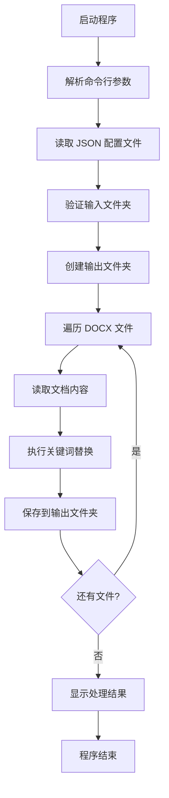

# DOCX 文档关键词替换工具产品需求文档

## 1. Product Overview

本项目是一个基于 Golang 开发的 DOCX 文档关键词替换控制台工具，用于批量处理 Word 文档中的关键词替换操作。
- 解决手动替换大量文档中关键词的效率问题，支持批量处理和自动化替换，适用于模板文档批量生成场景。
- 目标用户为需要批量处理文档的办公人员、开发人员和文档管理员。

## 2. Core Features

### 2.1 User Roles

本工具为单用户控制台程序，无需用户角色区分。

### 2.2 Feature Module

本 DOCX 关键词替换工具包含以下核心模块：
1. **配置解析模块**：解析 JSON 格式的关键词配置文件
2. **文档处理模块**：处理 DOCX 文档的读取、解析和写入
3. **关键词匹配模块**：实现 #KEY# 格式关键词的智能匹配和替换
4. **批量处理模块**：支持文件夹级别的批量文档处理
5. **控制台接口模块**：提供命令行参数解析和用户交互

### 2.3 Page Details

| 模块名称 | 功能组件 | 功能描述 |
|----------|----------|----------|
| 配置解析模块 | JSON 解析器 | 读取和解析 rtt.json 格式的关键词配置文件，验证配置格式正确性 |
| 文档处理模块 | DOCX 读取器 | 使用 go-docx 库读取 DOCX 文档结构和内容 |
| 文档处理模块 | DOCX 写入器 | 将处理后的内容写入新的 DOCX 文档 |
| 关键词匹配模块 | 普通文本匹配 | 在文档正文中查找和替换 #KEY# 格式的关键词 |
| 关键词匹配模块 | 表格文本匹配 | 处理表格中被 XML 分割的关键词，实现跨标签匹配 |
| 关键词匹配模块 | 分割关键词重组 | 识别和重组被 XML 标签分割的关键词片段 |
| 批量处理模块 | 文件遍历器 | 遍历输入文件夹中的所有 DOCX 文件 |
| 批量处理模块 | 进度跟踪器 | 显示批量处理进度和结果统计 |
| 控制台接口模块 | 参数解析器 | 解析命令行参数：JSON 文件路径、输入文件夹、输出文件夹 |
| 控制台接口模块 | 错误处理器 | 处理和显示各种错误信息，提供用户友好的错误提示 |

## 3. Core Process

主要用户操作流程：
1. 用户准备 JSON 关键词配置文件（参考 rtt.json 格式）
2. 用户通过命令行指定 JSON 文件路径、输入文件夹和输出文件夹
3. 程序读取配置文件，验证参数有效性
4. 程序遍历输入文件夹中的所有 DOCX 文件
5. 对每个文件执行关键词匹配和替换操作
6. 将处理后的文件保存到输出文件夹
7. 显示处理结果和统计信息

## 4. User Interface Design

### 4.1 Design Style

作为控制台程序，界面设计重点关注：
- 清晰的命令行参数格式和帮助信息
- 友好的进度显示和状态反馈
- 结构化的错误信息和警告提示
- 简洁的处理结果统计输出

### 4.2 Page Design Overview

| 界面组件 | 显示内容 | 设计要求 |
|----------|----------|----------|
| 启动界面 | 程序名称和版本信息 | 简洁明了，包含基本使用说明 |
| 参数帮助 | 命令行参数说明 | 详细的参数格式和示例 |
| 处理进度 | 当前处理文件和进度百分比 | 实时更新，包含文件名和处理状态 |
| 错误信息 | 具体错误描述和建议 | 清晰的错误分类和解决建议 |
| 结果统计 | 处理文件数量和成功率 | 汇总信息，包含处理时间 |

### 4.3 Responsiveness

控制台程序无需考虑响应式设计，重点关注不同终端环境下的兼容性和文本显示效果。