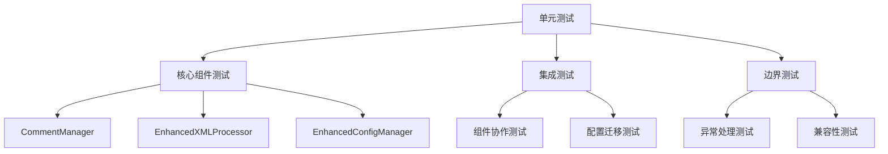

# 单元测试设计方案

## 1. 测试策略概述

### 测试原则
- **适度测试**：重点测试核心功能和边界情况，避免过度测试
- **分层测试**：按照组件层次进行测试，确保每层职责清晰
- **实用性优先**：优先测试用户最关心的功能路径
- **维护性考虑**：测试代码应易于维护和理解

### 测试覆盖范围


## 2. CommentManager 测试

### 2.1 核心功能测试
```go
package comment

import (
	"testing"
	"github.com/stretchr/testify/assert"
	"github.com/stretchr/testify/require"
)

// TestCommentManager_ParseComment 测试注释解析
func TestCommentManager_ParseComment(t *testing.T) {
	tests := []struct {
		name     string
		comment  string
		expected *ReplacementComment
		wantErr  bool
	}{
		{
			name:    "有效注释",
			comment: "<!-- DOCX_REPLACER_ORIGINAL:#产品名称# -->",
			expected: &ReplacementComment{
				OriginalKeyword: "产品名称",
				Format:         "DOCX_REPLACER_ORIGINAL",
			},
			wantErr: false,
		},
		{
			name:     "无效格式",
			comment:  "<!-- 普通注释 -->",
			expected: nil,
			wantErr:  true,
		},
		{
			name:     "空注释",
			comment:  "",
			expected: nil,
			wantErr:  true,
		},
	}

	cm := NewCommentManager(DefaultCommentConfig())

	for _, tt := range tests {
		t.Run(tt.name, func(t *testing.T) {
			result, err := cm.ParseComment(tt.comment)
			
			if tt.wantErr {
				assert.Error(t, err)
				assert.Nil(t, result)
			} else {
				assert.NoError(t, err)
				assert.Equal(t, tt.expected.OriginalKeyword, result.OriginalKeyword)
				assert.Equal(t, tt.expected.Format, result.Format)
			}
		})
	}
}

// TestCommentManager_GenerateComment 测试注释生成
func TestCommentManager_GenerateComment(t *testing.T) {
	cm := NewCommentManager(DefaultCommentConfig())
	
	comment := cm.GenerateComment("产品名称")
	expected := "<!-- DOCX_REPLACER_ORIGINAL:#产品名称# -->"
	
	assert.Equal(t, expected, comment)
}

// TestCommentManager_ScanDocumentComments 测试文档注释扫描
func TestCommentManager_ScanDocumentComments(t *testing.T) {
	xmlContent := `<?xml version="1.0"?>
<document>
	<!-- DOCX_REPLACER_ORIGINAL:#产品名称# -->
	<p>iPhone16</p>
	<!-- DOCX_REPLACER_ORIGINAL:#公司名称# -->
	<p>Apple Inc.</p>
	<!-- 普通注释 -->
</document>`

	cm := NewCommentManager(DefaultCommentConfig())
	comments, err := cm.ScanDocumentComments(xmlContent)
	
	require.NoError(t, err)
	assert.Len(t, comments, 2)
	assert.Equal(t, "产品名称", comments[0].OriginalKeyword)
	assert.Equal(t, "公司名称", comments[1].OriginalKeyword)
}
```

### 2.2 边界情况测试
```go
// TestCommentManager_EdgeCases 测试边界情况
func TestCommentManager_EdgeCases(t *testing.T) {
	cm := NewCommentManager(DefaultCommentConfig())
	
	t.Run("特殊字符关键词", func(t *testing.T) {
		keyword := "产品@名称#123"
		comment := cm.GenerateComment(keyword)
		parsed, err := cm.ParseComment(comment)
		
		assert.NoError(t, err)
		assert.Equal(t, keyword, parsed.OriginalKeyword)
	})
	
	t.Run("空关键词", func(t *testing.T) {
		comment := cm.GenerateComment("")
		_, err := cm.ParseComment(comment)
		
		assert.Error(t, err)
	})
	
	t.Run("超长关键词", func(t *testing.T) {
		longKeyword := strings.Repeat("长关键词", 100)
		comment := cm.GenerateComment(longKeyword)
		parsed, err := cm.ParseComment(comment)
		
		assert.NoError(t, err)
		assert.Equal(t, longKeyword, parsed.OriginalKeyword)
	})
}
```

## 3. EnhancedXMLProcessor 测试

### 3.1 核心替换功能测试
```go
package processor

import (
	"testing"
	"github.com/stretchr/testify/assert"
	"github.com/stretchr/testify/require"
)

// TestEnhancedXMLProcessor_ReplaceWithComments 测试带注释的替换
func TestEnhancedXMLProcessor_ReplaceWithComments(t *testing.T) {
	processor := NewEnhancedXMLProcessor()
	
	// 启用注释追踪
	config := &ProcessorConfig{
		EnableCommentTracking: true,
		CommentFormat:        "DOCX_REPLACER_ORIGINAL",
	}
	processor.SetConfig(config)
	
	keywords := map[string]string{
		"#产品名称#": "iPhone16",
		"#公司名称#": "Apple Inc.",
	}
	
	xmlContent := `<?xml version="1.0"?>
<document>
	<p>#产品名称#由#公司名称#开发</p>
</document>`
	
	result, err := processor.ReplaceKeywords(xmlContent, keywords)
	
	require.NoError(t, err)
	
	// 验证替换结果
	assert.Contains(t, result.Content, "iPhone16")
	assert.Contains(t, result.Content, "Apple Inc.")
	
	// 验证注释存在
	assert.Contains(t, result.Content, "<!-- DOCX_REPLACER_ORIGINAL:#产品名称# -->")
	assert.Contains(t, result.Content, "<!-- DOCX_REPLACER_ORIGINAL:#公司名称# -->")
	
	// 验证统计信息
	assert.Equal(t, 2, result.Stats.TotalReplacements)
	assert.Equal(t, 2, result.Stats.CommentReplacements)
}

// TestEnhancedXMLProcessor_SecondReplacement 测试二次替换
func TestEnhancedXMLProcessor_SecondReplacement(t *testing.T) {
	processor := NewEnhancedXMLProcessor()
	
	config := &ProcessorConfig{
		EnableCommentTracking: true,
		CommentFormat:        "DOCX_REPLACER_ORIGINAL",
	}
	processor.SetConfig(config)
	
	// 第一次替换后的内容（包含注释）
	xmlContent := `<?xml version="1.0"?>
<document>
	<!-- DOCX_REPLACER_ORIGINAL:#产品名称# -->
	<p>iPhone15由<!-- DOCX_REPLACER_ORIGINAL:#公司名称# -->Apple开发</p>
</document>`
	
	// 第二次替换的关键词
	keywords := map[string]string{
		"#产品名称#": "iPhone16",
		"#公司名称#": "Apple Inc.",
	}
	
	result, err := processor.ReplaceKeywords(xmlContent, keywords)
	
	require.NoError(t, err)
	
	// 验证能够正确识别并替换
	assert.Contains(t, result.Content, "iPhone16")
	assert.Contains(t, result.Content, "Apple Inc.")
	assert.Equal(t, 2, result.Stats.CommentReplacements)
}
```

### 3.2 兼容性测试
```go
// TestEnhancedXMLProcessor_BackwardCompatibility 测试向后兼容性
func TestEnhancedXMLProcessor_BackwardCompatibility(t *testing.T) {
	processor := NewEnhancedXMLProcessor()
	
	// 禁用注释追踪（模拟旧版本行为）
	config := &ProcessorConfig{
		EnableCommentTracking: false,
	}
	processor.SetConfig(config)
	
	keywords := map[string]string{
		"#产品名称#": "iPhone16",
	}
	
	xmlContent := `<?xml version="1.0"?>
<document>
	<p>#产品名称#</p>
</document>`
	
	result, err := processor.ReplaceKeywords(xmlContent, keywords)
	
	require.NoError(t, err)
	
	// 验证替换正常
	assert.Contains(t, result.Content, "iPhone16")
	
	// 验证没有注释
	assert.NotContains(t, result.Content, "DOCX_REPLACER_ORIGINAL")
	assert.Equal(t, 0, result.Stats.CommentReplacements)
	assert.Equal(t, 1, result.Stats.DirectReplacements)
}

// TestEnhancedXMLProcessor_MixedContent 测试混合内容处理
func TestEnhancedXMLProcessor_MixedContent(t *testing.T) {
	processor := NewEnhancedXMLProcessor()
	
	config := &ProcessorConfig{
		EnableCommentTracking: true,
	}
	processor.SetConfig(config)
	
	// 包含已有注释和新关键词的混合内容
	xmlContent := `<?xml version="1.0"?>
<document>
	<!-- DOCX_REPLACER_ORIGINAL:#旧产品# -->
	<p>iPhone15和#新产品#</p>
</document>`
	
	keywords := map[string]string{
		"#旧产品#": "iPhone16",  // 通过注释替换
		"#新产品#": "iPad Pro", // 直接替换
	}
	
	result, err := processor.ReplaceKeywords(xmlContent, keywords)
	
	require.NoError(t, err)
	
	assert.Contains(t, result.Content, "iPhone16")
	assert.Contains(t, result.Content, "iPad Pro")
	assert.Equal(t, 1, result.Stats.CommentReplacements)
	assert.Equal(t, 1, result.Stats.DirectReplacements)
}
```

## 4. EnhancedConfigManager 测试

### 4.1 配置加载和迁移测试
```go
package config

import (
	"encoding/json"
	"io/ioutil"
	"os"
	"path/filepath"
	"testing"
	"github.com/stretchr/testify/assert"
	"github.com/stretchr/testify/require"
)

// TestEnhancedConfigManager_LoadWithMigration 测试配置加载和迁移
func TestEnhancedConfigManager_LoadWithMigration(t *testing.T) {
	ecm := NewEnhancedConfigManager()
	
	t.Run("加载v2.0配置", func(t *testing.T) {
		// 创建临时配置文件
		tempFile := createTempConfig(t, `{
			"project_name": "测试项目",
			"version": "2.0",
			"keywords": [
				{"key": "产品", "value": "iPhone", "enabled": true}
			],
			"comment_tracking": {
				"enable_comment_tracking": true
			}
		}`)
		defer os.Remove(tempFile)
		
		config, err := ecm.LoadConfigWithMigration(tempFile)
		
		require.NoError(t, err)
		assert.Equal(t, "测试项目", config.ProjectName)
		assert.Equal(t, "2.0", config.Version)
		assert.True(t, config.CommentTracking.EnableCommentTracking)
	})
	
	t.Run("迁移v1.0配置", func(t *testing.T) {
		// 创建v1.0格式的配置文件
		tempFile := createTempConfig(t, `{
			"project_name": "旧项目",
			"keywords": [
				{"key": "产品", "value": "iPhone"}
			]
		}`)
		defer os.Remove(tempFile)
		
		config, err := ecm.LoadConfigWithMigration(tempFile)
		
		require.NoError(t, err)
		assert.Equal(t, "2.0", config.Version) // 应该被迁移到v2.0
		assert.NotNil(t, config.CommentTracking) // 应该有默认的注释追踪配置
		assert.False(t, config.CommentTracking.EnableCommentTracking) // 默认禁用以保持兼容性
	})
}

// TestEnhancedConfigManager_KeywordManagement 测试关键词管理
func TestEnhancedConfigManager_KeywordManagement(t *testing.T) {
	ecm := NewEnhancedConfigManager()
	config := &Config{
		Keywords: []Keyword{
			{Key: "产品", Value: "iPhone", Enabled: boolPtr(true)},
			{Key: "公司", Value: "Apple", Enabled: boolPtr(false)},
		},
	}
	
	t.Run("获取启用的关键词", func(t *testing.T) {
		keywords := ecm.GetEnabledKeywords(config)
		
		assert.Len(t, keywords, 1)
		assert.Equal(t, "iPhone", keywords["#产品#"])
		_, exists := keywords["#公司#"]
		assert.False(t, exists) // 禁用的关键词不应该出现
	})
	
	t.Run("添加关键词", func(t *testing.T) {
		newKeyword := Keyword{Key: "版本", Value: "v1.0"}
		err := ecm.AddKeyword(config, newKeyword)
		
		assert.NoError(t, err)
		assert.Len(t, config.Keywords, 3)
	})
	
	t.Run("添加重复关键词", func(t *testing.T) {
		duplicateKeyword := Keyword{Key: "产品", Value: "iPad"}
		err := ecm.AddKeyword(config, duplicateKeyword)
		
		assert.Error(t, err)
		assert.Contains(t, err.Error(), "关键词已存在")
	})
}

// 辅助函数
func createTempConfig(t *testing.T, content string) string {
	tempFile, err := ioutil.TempFile("", "config_*.json")
	require.NoError(t, err)
	
	_, err = tempFile.WriteString(content)
	require.NoError(t, err)
	
	err = tempFile.Close()
	require.NoError(t, err)
	
	return tempFile.Name()
}

func boolPtr(b bool) *bool {
	return &b
}
```

### 4.2 配置验证测试
```go
// TestEnhancedConfigManager_Validation 测试配置验证
func TestEnhancedConfigManager_Validation(t *testing.T) {
	ecm := NewEnhancedConfigManager()
	
	tests := []struct {
		name    string
		config  *Config
		wantErr bool
		errMsg  string
	}{
		{
			name: "有效配置",
			config: &Config{
				ProjectName: "测试项目",
				Keywords: []Keyword{
					{Key: "产品", Value: "iPhone"},
				},
				CommentTracking: &CommentTracking{
					CommentFormat:     "DOCX_REPLACER_ORIGINAL",
					MaxCommentHistory: 10,
				},
			},
			wantErr: false,
		},
		{
			name:    "空配置",
			config:  nil,
			wantErr: true,
			errMsg:  "配置不能为空",
		},
		{
			name: "无效注释格式",
			config: &Config{
				ProjectName: "测试项目",
				Keywords: []Keyword{
					{Key: "产品", Value: "iPhone"},
				},
				CommentTracking: &CommentTracking{
					CommentFormat:     "", // 空格式
					MaxCommentHistory: 10,
				},
			},
			wantErr: true,
			errMsg:  "注释格式不能为空",
		},
	}
	
	for _, tt := range tests {
		t.Run(tt.name, func(t *testing.T) {
			err := ecm.ValidateEnhancedConfig(tt.config)
			
			if tt.wantErr {
				assert.Error(t, err)
				if tt.errMsg != "" {
					assert.Contains(t, err.Error(), tt.errMsg)
				}
			} else {
				assert.NoError(t, err)
			}
		})
	}
}
```

## 5. 集成测试

### 5.1 端到端测试
```go
package integration

import (
	"testing"
	"github.com/stretchr/testify/assert"
	"github.com/stretchr/testify/require"
)

// TestEndToEndReplacement 端到端替换测试
func TestEndToEndReplacement(t *testing.T) {
	// 创建配置
	ecm := NewEnhancedConfigManager()
	config := &Config{
		ProjectName: "集成测试",
		Keywords: []Keyword{
			{Key: "产品名称", Value: "iPhone16", Enabled: boolPtr(true)},
			{Key: "公司名称", Value: "Apple Inc.", Enabled: boolPtr(true)},
		},
		CommentTracking: &CommentTracking{
			EnableCommentTracking: true,
			CommentFormat:        "DOCX_REPLACER_ORIGINAL",
		},
	}
	
	// 创建处理器
	processor := NewEnhancedXMLProcessor()
	processor.SetConfig(&ProcessorConfig{
		EnableCommentTracking: config.CommentTracking.EnableCommentTracking,
		CommentFormat:        config.CommentTracking.CommentFormat,
	})
	
	// 第一次替换
	xmlContent := `<?xml version="1.0"?>
<document>
	<p>#产品名称#由#公司名称#开发</p>
</document>`
	
	keywords := ecm.GetEnabledKeywords(config)
	result1, err := processor.ReplaceKeywords(xmlContent, keywords)
	require.NoError(t, err)
	
	// 验证第一次替换
	assert.Contains(t, result1.Content, "iPhone16")
	assert.Contains(t, result1.Content, "Apple Inc.")
	assert.Equal(t, 2, result1.Stats.TotalReplacements)
	
	// 修改配置进行第二次替换
	config.Keywords[0].Value = "iPhone17" // 更新产品名称
	keywords2 := ecm.GetEnabledKeywords(config)
	
	// 第二次替换（使用第一次的结果）
	result2, err := processor.ReplaceKeywords(result1.Content, keywords2)
	require.NoError(t, err)
	
	// 验证第二次替换
	assert.Contains(t, result2.Content, "iPhone17") // 应该更新为新值
	assert.Contains(t, result2.Content, "Apple Inc.") // 保持不变
	assert.Equal(t, 2, result2.Stats.CommentReplacements) // 应该通过注释替换
}
```

## 6. 性能测试

### 6.1 基准测试
```go
// BenchmarkCommentManager_ParseComment 注释解析性能测试
func BenchmarkCommentManager_ParseComment(b *testing.B) {
	cm := NewCommentManager(DefaultCommentConfig())
	comment := "<!-- DOCX_REPLACER_ORIGINAL:#产品名称# -->"
	
	b.ResetTimer()
	for i := 0; i < b.N; i++ {
		_, _ = cm.ParseComment(comment)
	}
}

// BenchmarkEnhancedXMLProcessor_ReplaceKeywords 替换性能测试
func BenchmarkEnhancedXMLProcessor_ReplaceKeywords(b *testing.B) {
	processor := NewEnhancedXMLProcessor()
	processor.SetConfig(&ProcessorConfig{
		EnableCommentTracking: true,
	})
	
	// 创建包含多个关键词的大文档
	xmlContent := generateLargeXMLContent(1000) // 1000个关键词
	keywords := generateKeywords(1000)
	
	b.ResetTimer()
	for i := 0; i < b.N; i++ {
		_, _ = processor.ReplaceKeywords(xmlContent, keywords)
	}
}

// 辅助函数：生成大型XML内容
func generateLargeXMLContent(keywordCount int) string {
	// 实现生成包含指定数量关键词的XML内容
	// ...
}

// 辅助函数：生成关键词映射
func generateKeywords(count int) map[string]string {
	// 实现生成指定数量的关键词映射
	// ...
}
```

## 7. 测试工具和辅助函数

### 7.1 测试数据生成器
```go
package testutil

import (
	"fmt"
	"math/rand"
	"strings"
	"time"
)

// TestDataGenerator 测试数据生成器
type TestDataGenerator struct {
	rand *rand.Rand
}

// NewTestDataGenerator 创建测试数据生成器
func NewTestDataGenerator() *TestDataGenerator {
	return &TestDataGenerator{
		rand: rand.New(rand.NewSource(time.Now().UnixNano())),
	}
}

// GenerateKeywords 生成测试关键词
func (g *TestDataGenerator) GenerateKeywords(count int) []Keyword {
	keywords := make([]Keyword, count)
	for i := 0; i < count; i++ {
		enabled := true
		keywords[i] = Keyword{
			Key:     fmt.Sprintf("关键词%d", i+1),
			Value:   fmt.Sprintf("值%d", i+1),
			Enabled: &enabled,
		}
	}
	return keywords
}

// GenerateXMLContent 生成测试XML内容
func (g *TestDataGenerator) GenerateXMLContent(keywordCount int) string {
	var builder strings.Builder
	builder.WriteString(`<?xml version="1.0"?><document>`)
	
	for i := 0; i < keywordCount; i++ {
		builder.WriteString(fmt.Sprintf(`<p>#关键词%d#</p>`, i+1))
	}
	
	builder.WriteString(`</document>`)
	return builder.String()
}
```

### 7.2 测试断言辅助
```go
// AssertXMLContains 断言XML包含指定内容
func AssertXMLContains(t *testing.T, xmlContent, expected string) {
	assert.Contains(t, xmlContent, expected, "XML内容应该包含: %s", expected)
}

// AssertCommentExists 断言注释存在
func AssertCommentExists(t *testing.T, xmlContent, keyword string) {
	expectedComment := fmt.Sprintf("<!-- DOCX_REPLACER_ORIGINAL:#%s# -->", keyword)
	assert.Contains(t, xmlContent, expectedComment, "应该包含关键词注释: %s", keyword)
}

// AssertReplacementStats 断言替换统计信息
func AssertReplacementStats(t *testing.T, stats *ReplacementStats, expectedTotal, expectedComment, expectedDirect int) {
	assert.Equal(t, expectedTotal, stats.TotalReplacements, "总替换数不匹配")
	assert.Equal(t, expectedComment, stats.CommentReplacements, "注释替换数不匹配")
	assert.Equal(t, expectedDirect, stats.DirectReplacements, "直接替换数不匹配")
}
```

## 8. 测试配置和运行

### 8.1 测试配置文件
```go
// testconfig.go
package test

const (
	// 测试超时时间
	TestTimeout = 30 * time.Second
	
	// 基准测试运行时间
	BenchmarkDuration = 10 * time.Second
	
	// 测试数据目录
	TestDataDir = "testdata"
)

// TestConfig 测试配置
type TestConfig struct {
	EnableIntegrationTests bool
	EnablePerformanceTests bool
	TestDataPath          string
}

// DefaultTestConfig 默认测试配置
func DefaultTestConfig() *TestConfig {
	return &TestConfig{
		EnableIntegrationTests: true,
		EnablePerformanceTests: false, // 默认禁用性能测试
		TestDataPath:          TestDataDir,
	}
}
```

### 8.2 测试运行脚本
```bash
#!/bin/bash
# run_tests.sh

echo "运行单元测试..."
go test -v ./internal/comment -cover
go test -v ./internal/processor -cover
go test -v ./internal/config -cover

echo "运行集成测试..."
go test -v ./test/integration -tags=integration

echo "生成测试覆盖率报告..."
go test -coverprofile=coverage.out ./...
go tool cover -html=coverage.out -o coverage.html

echo "测试完成，覆盖率报告: coverage.html"
```

## 9. 测试最佳实践

### 9.1 测试原则
1. **单一职责**：每个测试只验证一个功能点
2. **独立性**：测试之间不应相互依赖
3. **可重复性**：测试结果应该是确定的
4. **快速执行**：单元测试应该快速完成
5. **清晰命名**：测试名称应该清楚表达测试意图

### 9.2 测试覆盖目标
- **核心功能覆盖率**: ≥ 90%
- **边界情况覆盖率**: ≥ 80%
- **错误处理覆盖率**: ≥ 85%
- **集成测试覆盖率**: ≥ 70%

### 9.3 不需要过度测试的部分
1. **简单的getter/setter方法**
2. **纯数据结构的字段访问**
3. **第三方库的功能**
4. **显而易见的逻辑**
5. **配置文件的格式验证**（基础验证即可）

这个测试设计方案确保了核心功能的可靠性，同时避免了过度测试，重点关注用户最关心的功能路径和边界情况。