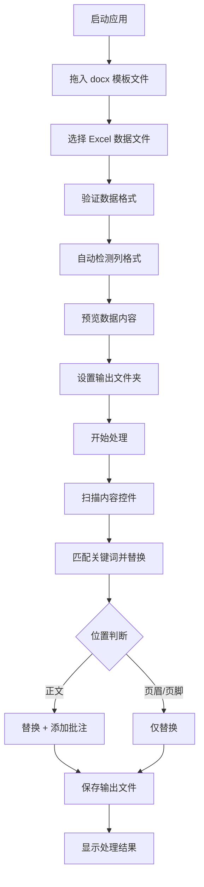
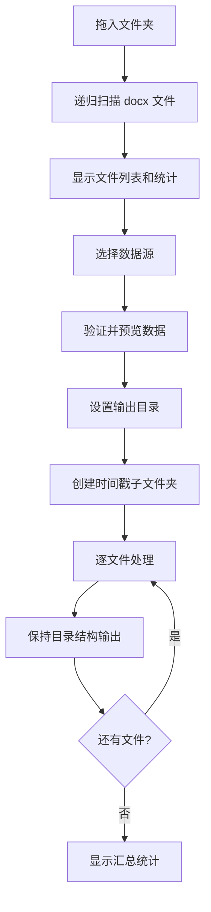
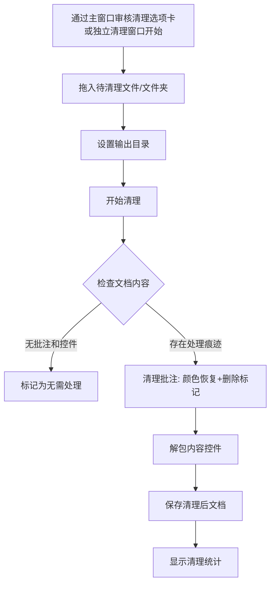

# DocuFiller 产品需求文档

## 1. 产品概述

DocuFiller 是一款面向业务团队的 Windows 桌面 Word 文档批量填充工具。通过 Word 内容控件（Content Control）的 Tag 属性实现精确定位和数据替换，解决手动复制粘贴效率低下和容易出错的问题。

### 1.1 核心价值

- **精确定位**：通过 Word 内容控件的 Tag 属性匹配关键词，避免纯文本替换导致的误匹配
- **格式保留**：支持 Excel 富文本格式（上标、下标）的完整保留
- **变更追踪**：自动添加批注记录每次替换的旧值、新值和时间
- **双格式支持**：支持 Excel 两列和三列两种数据格式
- **审核清理**：一键去除批注痕迹、恢复颜色、解除内容控件包装

### 1.2 目标用户

本产品为单机桌面应用，无需用户注册和角色区分，所有用户均可使用全部功能。主要面向需要批量处理 Word 文档的业务人员。

### 1.3 运行环境

- 操作系统：Windows 10 及以上
- 运行时：.NET 8
- 依赖：无需安装 Microsoft Office

---

## 2. 功能模块

### 2.1 模块总览

| 序号 | 模块名称 | 功能概述 |
|------|----------|----------|
| 1 | 文件输入模块 | 单文件选择和文件夹拖拽输入，自动扫描 docx 文件 |
| 2 | 数据配置模块 | Excel 数据源支持，两列和三列格式自动检测 |
| 3 | 文档处理模块 | 关键词替换、富文本格式保留、页眉页脚内容控件支持 |
| 4 | 批注追踪模块 | 正文区域自动添加变更批注（旧值、新值、时间） |
| 5 | 审核清理模块 | 去除批注痕迹、恢复颜色、解除内容控件包装 |

---

## 3. 各模块详细描述

### 3.1 文件输入模块

#### 功能说明

提供模板文件的输入方式，支持单文件和文件夹两种模式。

#### 页面元素

| 页面 | 区域 | 功能描述 |
|------|------|----------|
| 主界面 | 文件输入区域 | 大型拖拽区域（虚线边框，拖拽时蓝色高亮），支持拖入单个 .docx 文件或包含 .docx 文件的文件夹 |
| 主界面 | 文件列表 | 文件/文件夹图标，支持的格式提示文字，显示文件列表和统计信息 |

#### 业务规则

- **单文件模式**：拖入单个 .docx 文件，直接作为处理模板
- **文件夹模式**：拖入文件夹，系统自动递归扫描子目录，识别所有 .docx 文件
- **文件格式**：仅支持 .docx 格式，不支持 .doc（旧格式）和 .dotx
- **输入类型切换**：单文件和文件夹模式互斥，选择新的输入方式时自动清除之前的输入
- **文件统计**：显示扫描到的文件数量和文件列表

---

### 3.2 数据配置模块

#### 功能说明

选择和配置 Excel 数据源文件。

#### 页面元素

| 页面 | 区域 | 功能描述 |
|------|------|----------|
| 主界面 | 数据文件选择 | 文件选择按钮，支持 .xlsx 格式 |
| 主界面 | 数据类型指示 | 自动识别并显示当前 Excel 列格式（两列/三列） |
| 主界面 | 数据预览 | 数据预览表格，显示字段映射关系 |
| 主界面 | 数据验证 | 验证状态指示器，显示数据格式校验结果 |

#### Excel 数据格式

Excel 文件支持两种列格式，系统自动检测：

**两列模式（关键词 | 值）**：

| 关键词 | 值 |
|--------|-----|
| #FieldA# | 张三 |
| #FieldB# | 李四 |

- 第一列直接为关键词（以 `#` 包围），第二列为替换值
- 系统检测到第一列内容匹配 `#xxx#` 格式时自动识别为两列模式

**三列模式（ID | 关键词 | 值）**：

| ID | 关键词 | 值 |
|----|--------|-----|
| 1 | #FieldA# | 张三 |
| 2 | #FieldB# | 李四 |

- 第一列为行标识（ID），第二列为关键词，第三列为替换值
- 系统检测到第一列内容不匹配 `#xxx#` 格式时自动识别为三列模式

#### Excel 富文本格式保留

Excel 数据源支持保留单元格中的富文本格式：

- **上标（Superscript）**：保留上标格式到 Word 文档
- **下标（Subscript）**：保留下标格式到 Word 文档
- **富文本检测**：自动检测单元格是否为富文本（RichText），分别解析各片段的格式信息
- **普通文本兼容**：非富文本单元格按普通文本处理，同时检查单元格级别的格式设置

#### 业务规则

- **格式检测**：自动根据第一行第一列的内容判断两列或三列模式
- **关键词格式要求**：关键词必须以 `#` 开头和结尾（如 `#姓名#`），否则标记为格式不正确
- **重复关键词**：同一文件中不允许出现重复关键词
- **重复 ID（三列模式）**：三列模式下 ID 列的值不允许重复
- **空行跳过**：自动跳过空行
- **行数限制**：单个 Excel 文件最大支持 10,000 行
- **文件格式**：仅支持 .xlsx 格式
- **数据预览**：默认预览前 10 条记录

---

### 3.3 文档处理模块

#### 功能说明

核心模块，负责将数据源中的关键词-值对替换到 Word 模板的内容控件中。

#### 页面元素

| 页面 | 区域 | 功能描述 |
|------|------|----------|
| 主界面 | 输出设置区域 | 输出文件夹拖拽选择区域，时间戳子文件夹名称预览 |
| 主界面 | 处理控制区域 | 开始处理按钮、进度条、当前处理文件显示 |
| 主界面 | 结果显示区域 | 处理统计（成功/失败数量）、结果文件列表、错误日志、打开输出文件夹按钮 |

#### 3.3.1 关键词替换机制

通过 Word 内容控件（Structured Document Tag, SDT）的 Tag 属性实现精确匹配：

1. 系统扫描模板文档中的所有内容控件
2. 读取每个内容控件的 Tag 值
3. 在数据源中查找与 Tag 匹配的关键词
4. 将匹配到的值替换到内容控件中
5. 替换后的文本以红色显示

#### 3.3.2 内容控件位置支持

系统支持文档中三个位置的内容控件替换：

| 位置 | 说明 | 批注支持 |
|------|------|----------|
| 正文（Body） | 文档主体区域的内容控件 | ✅ 支持自动批注 |
| 页眉（Header） | 页眉区域的内容控件 | ❌ 不支持批注 |
| 页脚（Footer） | 页脚区域的内容控件 | ❌ 不支持批注 |

- 系统自动遍历文档主体、所有页眉部分和所有页脚部分的内容控件
- 嵌套内容控件处理：如果控件存在具有相同 Tag 的祖先控件，则跳过（仅处理最外层）

#### 3.3.3 表格中的内容控件处理

表格中的内容控件替换需要特别处理以保持表格结构：

| 场景 | 检测方式 | 处理方法 |
|------|----------|----------|
| 控件在单元格内 | `isInTableCell = true` | 安全替换文本，保留单元格结构 |
| 控件包装单元格 | `containsTableCell = true` | 找到被包装的 TableCell，只替换文本内容，不删除 TableCell |
| 普通控件 | 两者均为 false | 标准替换流程 |

**关键约束**：处理表格中的控件时，绝不删除 TableCell 结构，确保表格布局完整性。

#### 3.3.4 富文本格式保留

当使用 Excel 数据源时，系统保留单元格中的格式信息到 Word 文档：

- 通过 `FormattedCellValue` 模型传递格式化数据
- 每个文本片段（`TextFragment`）携带上标/下标格式标记
- 使用 `SafeFormattedContentReplacer` 服务处理格式化内容的替换
- 同样遵循表格单元格安全替换策略

#### 业务规则

- **输出文件夹**：用户拖拽选择输出根目录
- **时间戳子文件夹**：系统自动创建以当前时间命名的子文件夹（格式：`yyyyMMddHHmmss`）
- **目录结构保持**：文件夹模式下，输出文件保持与输入文件相同的相对目录结构
- **取消支持**：处理过程中可随时取消，已完成的文件不受影响
- **进度显示**：实时显示处理进度百分比和当前处理的文件名
- **结果统计**：处理完成后显示成功/失败数量，失败文件显示错误原因

---

### 3.4 批注追踪模块

#### 功能说明

文档处理时自动为正文区域的内容控件添加变更批注，记录替换的详细信息。

#### 批注内容格式

```
此字段（正文）已于 2025年4月23日 14:30:00 更新。标签：#姓名#，旧值：[张三]，新值：李四
```

批注信息包含：

| 字段 | 说明 |
|------|------|
| 位置 | 标注内容控件所在位置（正文/页眉/页脚） |
| 时间 | 替换操作的精确时间（年月日 时:分:秒） |
| 标签 | 内容控件的 Tag 值 |
| 旧值 | 替换前的原始文本（方括号包围） |
| 新值 | 替换后的新文本 |

#### 批注规则

- **正文区域**：自动添加批注
- **页眉/页脚**：不添加批注（Word API 限制，批注仅支持主文档区域）
- **单行文本**：使用单 Run 批注方式
- **多行文本**：使用范围批注方式（CommentRangeStart/End 包裹多个 Run）
- **批注作者**：固定为 "DocuFiller系统"
- **空控件跳过**：如果内容控件中没有 Run 元素，跳过批注添加
- **无数据跳过**：如果数据源中没有匹配的关键词，跳过该控件

---

### 3.5 审核清理模块

#### 功能说明

提供主窗口审核清理选项卡和独立清理窗口两种入口，用于去除 DocuFiller 生成的处理痕迹，使文档看起来为最终版本。主窗口选项卡共享 `CleanupViewModel`，支持输出目录选择（双模式清理：输出到指定目录或就地处理）；独立清理窗口仅支持就地处理。

#### 页面元素

| 页面 | 区域 | 功能描述 |
|------|------|----------|
| 主窗口审核清理选项卡 | 输出目录 | 输出目录选择器（默认 Documents\DocuFiller输出\清理），浏览按钮，打开文件夹按钮 |
| 主窗口审核清理选项卡 | 文件输入 | 拖放区域（支持单文件和文件夹），文件列表（显示文件名、大小、状态），移除/清空按钮 |
| 主窗口审核清理选项卡 | 处理控制 | 开始清理按钮、进度条、进度状态文本 |
| 独立清理窗口 | 文件输入 | 拖拽区域（支持单文件和文件夹），文件列表（显示文件名、大小、状态），移除/清空按钮 |
| 独立清理窗口 | 处理控制 | 开始清理按钮、进度条、进度状态文本，关闭按钮 |
| 两种入口共用 | 结果显示 | 清理统计（批注移除数、控件解包数），每文件状态跟踪 |

> **注意**：主窗口选项卡模式默认输出目录为 `Documents\DocuFiller输出\清理`，用户可自定义或留空表示就地处理。独立清理窗口仅支持就地处理（覆盖原文件）。两种入口共用同一个 `CleanupViewModel`。

#### 3.5.1 清理操作

清理过程包含两个步骤：

**步骤一：批注清理**

1. 将所有被批注标记的文本颜色恢复为黑色
2. 删除批注范围标记（CommentRangeStart、CommentRangeEnd）
3. 删除批注引用标记（CommentReference）
4. 删除批注内容部分（WordprocessingCommentsPart）

**步骤二：内容控件解包**

1. 遍历文档主体、页眉和页脚中的所有内容控件
2. 移除 SdtElement 包装，保留内部内容
3. 处理三种控件类型：
   - `SdtRun`（行内控件）：直接替换为内容
   - `SdtBlock`（块级控件）：替换为内部段落
   - `SdtCell`（单元格控件）：替换为内部单元格

#### 业务规则

- **输入支持**：单文件和文件夹两种模式
- **输出目录**：选项卡模式默认输出到 `Documents\DocuFiller输出\清理`，用户可自定义；独立清理窗口就地覆盖
- **文件格式**：仅支持 .docx 格式
- **自动跳过**：如果文档没有批注和内容控件，标记为"无需处理"
- **状态跟踪**：每个文件有独立的状态（待处理/处理中/成功/失败/无需处理）
- **进度报告**：批量处理时报告总体进度

---

## 4. 核心流程

### 4.1 单文件处理流程



### 4.2 文件夹批量处理流程



### 4.3 审核清理流程



---

## 5. 用户界面设计

### 5.1 设计风格

| 设计元素 | 规范 |
|----------|------|
| 主色调 | 深蓝色 (#2C3E50)、浅蓝色 (#3498DB) |
| 成功色 | 绿色 (#27AE60) |
| 错误色 | 红色 (#E74C3C) |
| 警告色 | 橙色 (#E67E22) |
| 按钮样式 | 圆角矩形，3D 效果，悬停时颜色加深 |
| 字体 | 微软雅黑，标题 16px，正文 12px |
| 布局风格 | 卡片式布局，选项卡导航 |
| 图标风格 | 线性图标，简洁现代 |
| 拖拽区域 | 虚线边框，拖拽时高亮显示 |

### 5.2 主界面布局

| 区域 | 模块 | UI 元素 |
|------|------|---------|
| 选项卡导航 | 页面切换 | 关键词替换选项卡、审核清理选项卡 |
| 文件输入 | 文件输入区域 | 大型拖拽区域（虚线边框，拖拽时蓝色高亮），文件/文件夹图标，格式提示文字，文件列表树形控件，文件统计信息 |
| 数据配置 | 数据配置区域 | 数据文件选择按钮，数据类型显示（Excel 两列/三列格式），数据预览表格，字段映射显示，数据验证状态指示器 |
| 输出设置 | 输出设置区域 | 输出文件夹拖拽区域，时间戳文件夹名称预览，输出路径显示 |
| 处理控制 | 处理控制区域 | 开始处理按钮、取消处理按钮、退出按钮，进度条，当前处理文件显示 |
| 结果展示 | 结果显示区域 | 处理统计卡片（成功/失败数量），结果文件列表，错误日志区域，打开输出文件夹按钮 |
| 底部状态栏 | 状态与更新 | 版本号显示、处理进度消息、更新状态文本（可点击）、更新源设置按钮（齿轮图标）、检查更新按钮、新版本红点提示 |

### 5.3 清理功能界面布局

清理功能提供两种入口：主窗口审核清理选项卡和独立清理窗口。

#### 主窗口审核清理选项卡

| 区域 | UI 元素 |
|------|---------|
| 输出目录 | 目录路径文本框、浏览按钮、打开文件夹按钮 |
| 文件输入 | 拖放区域（虚线边框，支持单文件和文件夹），格式提示文字 |
| 文件列表 | ListView（文件名、大小、状态列），移除选中按钮，清空列表按钮 |
| 处理控制 | 进度状态文本、进度条、开始清理按钮 |

- 默认输出目录：`Documents\DocuFiller输出\清理`
- 支持双模式清理：设置输出目录则输出到指定位置，不设置则就地覆盖

#### 独立清理窗口

| 区域 | UI 元素 |
|------|---------|
| 标题 | "审核清理"标题文字 |
| 文件输入 | 拖放区域（支持单文件和文件夹），文件列表（文件名、大小、状态列），移除选中按钮，清空列表按钮 |
| 处理控制 | 进度状态文本、进度条、开始清理按钮、关闭按钮 |

- 仅支持就地处理（覆盖原文件）
- 通过主窗口菜单/命令打开

### 5.4 响应式设计

- 最小窗口尺寸：1000×700 像素
- 支持窗口缩放和最小化
- 支持高 DPI 显示器
- 拖拽区域在不同窗口尺寸下保持可用性

---

## 6. 数据模型

### 6.1 关键词匹配格式

内容控件的 Tag 值用于与数据源中的关键词匹配：

| 数据源类型 | 关键词格式 | 匹配规则 |
|------------|------------|----------|
| Excel 两列 | `#关键词#` | Tag 值 = Excel 第一列值 |
| Excel 三列 | `#关键词#` | Tag 值 = Excel 第二列值 |

### 6.2 核心数据结构

| 模型 | 用途 |
|------|------|
| `ContentControlData` | 内容控件信息（Tag、标题、值、类型、位置、是否必填） |
| `FormattedCellValue` | 带格式的单元格值（文本片段列表） |
| `TextFragment` | 单个文本片段（文本内容 + 上标/下标标记） |
| `ProcessRequest` | 文档处理请求参数 |
| `ProcessResult` | 文档处理结果和统计 |
| `FolderProcessRequest` | 文件夹批量处理请求 |
| `CleanupFileItem` | 清理文件项（文件路径、大小、状态） |
| `CleanupResult` | 清理结果（移除批注数、解包控件数） |
| `ExcelValidationResult` | Excel 数据验证结果 |
| `ExcelFileSummary` | Excel 文件摘要（行数、有效行数、重复项） |

---

## 7. 非功能性需求

### 7.1 性能要求

| 指标 | 要求 |
|------|------|
| 单文件处理 | 在 5 秒内完成（不含超大文档） |
| 文件夹批量处理 | 支持同时处理 100+ 文件 |
| Excel 数据解析 | 最大支持 10,000 行 |
| 内存占用 | 处理期间内存不超过 500MB |

### 7.2 可靠性要求

- 处理失败时输出有意义的错误信息
- 支持取消操作，已完成的文件不受影响
- 文件格式验证在处理前完成，避免无效操作
- 异常不导致应用崩溃（全局异常处理）

### 7.3 安全性要求

- 所有文件操作均在用户指定目录内进行
- 不修改原始模板文件
- 输出文件保存在独立的输出目录中
