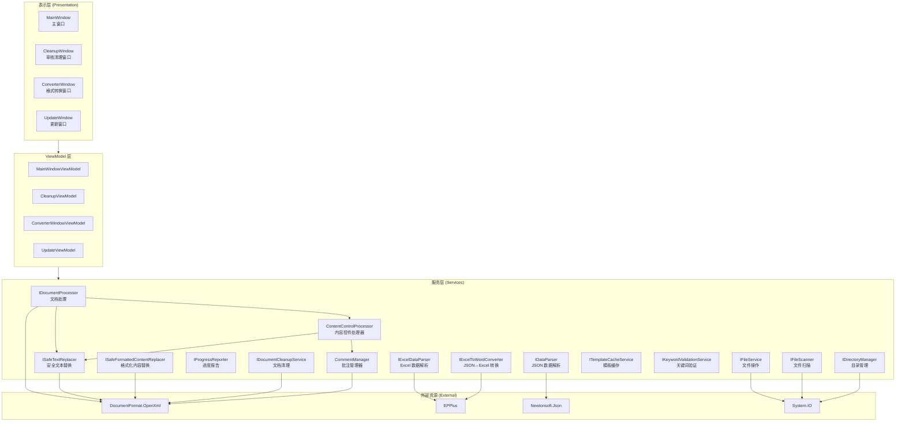
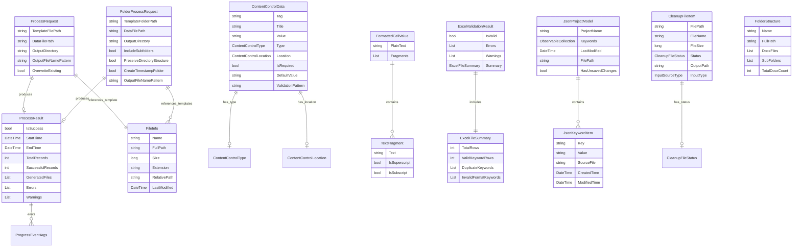
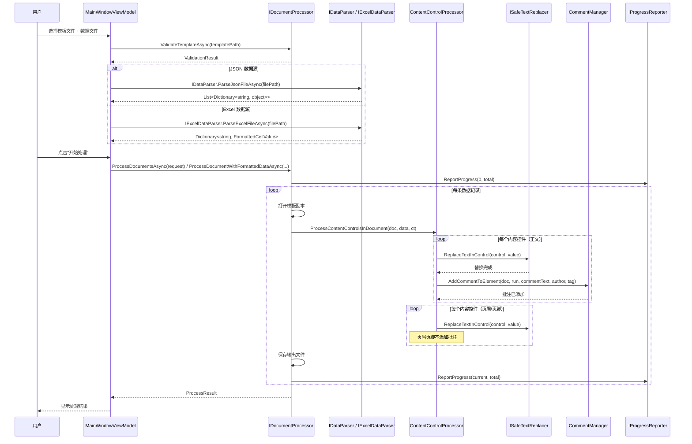
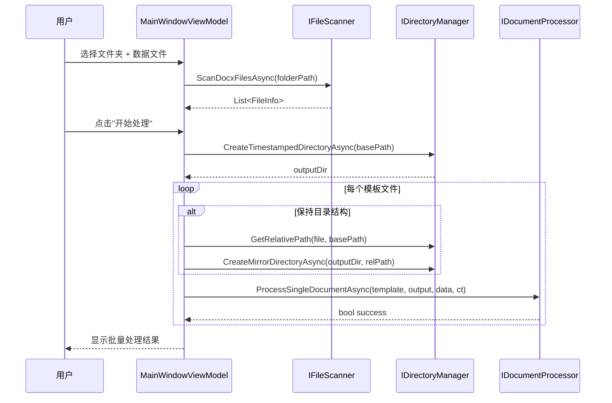
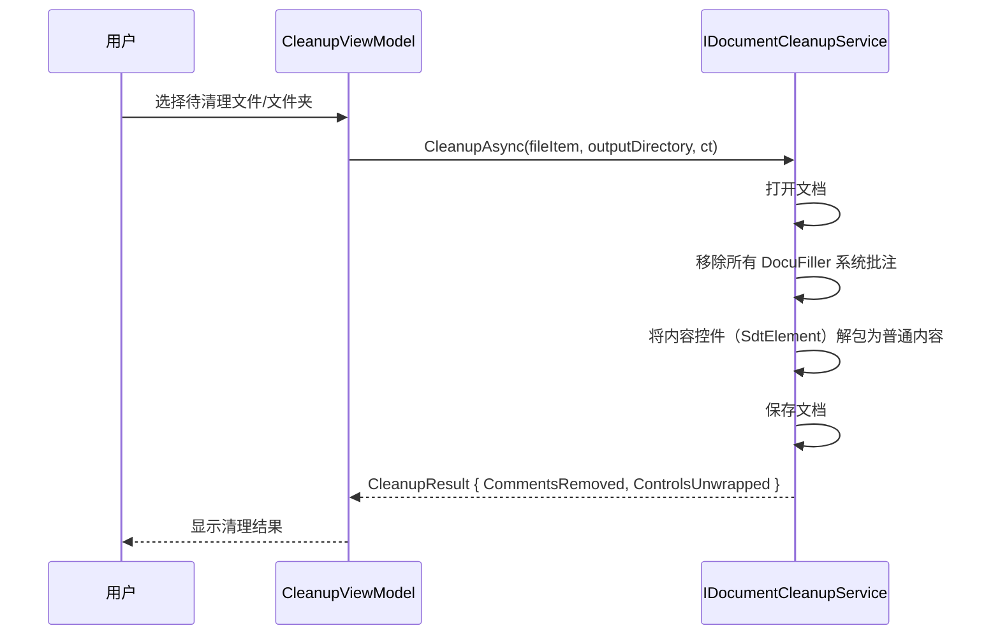

# DocuFiller 技术架构文档

> **版本**: 2.0  
> **最后更新**: 2026-04-23  
> **适用范围**: DocuFiller 桌面应用程序全部功能

---

## 目录

1. [架构设计](#1-架构设计)
2. [技术栈说明](#2-技术栈说明)
3. [服务层架构](#3-服务层架构)
4. [API 定义（接口详情）](#4-api-定义接口详情)
5. [数据模型](#5-数据模型)
6. [处理管道](#6-处理管道)
7. [表格内容控件处理](#7-表格内容控件处理)
8. [依赖注入配置](#8-依赖注入配置)

---

## 1. 架构设计

DocuFiller 采用经典 WPF 分层架构，分为表示层、业务层、服务层和外部资源四个层次：



### 架构层次职责

| 层次 | 职责 | 关键组件 |
|------|------|----------|
| **表示层** | 用户交互、数据展示、操作触发 | MainWindow, CleanupWindow, ConverterWindow |
| **ViewModel 层** | 业务逻辑协调、状态管理、数据绑定 | MainWindowViewModel, CleanupViewModel |
| **服务层** | 核心业务逻辑实现、接口抽象 | 15 个服务接口 + 2 个处理器类 |
| **外部资源** | 第三方库封装、系统资源访问 | OpenXml, EPPlus, Newtonsoft.Json, System.IO |

---

## 2. 技术栈说明

| 技术 | 版本 | 用途 |
|------|------|------|
| **.NET** | 8.0 | 应用程序运行时框架 |
| **WPF** | .NET 8 内置 | 桌面 UI 框架 |
| **DocumentFormat.OpenXml** | 3.0+ | Word 文档（.docx/.dotx）读写操作 |
| **EPPlus** | — | Excel 文件（.xlsx）读写操作 |
| **Newtonsoft.Json** | 13.0+ | JSON 数据文件解析 |
| **Microsoft.Extensions.DependencyInjection** | — | 依赖注入容器 |
| **Microsoft.Extensions.Logging** | — | 日志记录框架 |
| **Microsoft.Extensions.Options** | — | 配置选项模式 |
| **System.IO** | .NET 8 内置 | 文件系统操作 |

---

## 3. 服务层架构

### 服务注册总览

| 服务名称 | 接口 | 实现类 | 生命周期 | 职责 |
|----------|------|--------|----------|------|
| 文档处理 | `IDocumentProcessor` | `DocumentProcessorService` | Singleton | 批量文档处理主入口 |
| JSON 数据解析 | `IDataParser` | `DataParserService` | Singleton | JSON 文件解析与验证 |
| Excel 数据解析 | `IExcelDataParser` | `ExcelDataParserService` | Singleton | Excel 文件解析（两列/三列格式） |
| 文件操作 | `IFileService` | `FileService` | Singleton | 文件读写、复制、验证 |
| 进度报告 | `IProgressReporter` | `ProgressReporterService` | Singleton | 处理进度追踪与报告 |
| 文件扫描 | `IFileScanner` | `FileScannerService` | Singleton | 文件夹中的 .docx 文件发现 |
| 目录管理 | `IDirectoryManager` | `DirectoryManagerService` | Singleton | 输出目录创建、时间戳文件夹 |
| JSON↔Excel 转换 | `IExcelToWordConverter` | `ExcelToWordConverterService` | Singleton | JSON 与 Excel 格式互转 |
| 安全文本替换 | `ISafeTextReplacer` | `SafeTextReplacer` | Singleton | 保留表格结构的文本替换 |
| 格式化内容替换 | `ISafeFormattedContentReplacer` | `SafeFormattedContentReplacer` | Singleton | 保留富文本格式的内容替换 |
| 模板缓存 | `ITemplateCacheService` | `TemplateCacheService` | Singleton | 模板验证结果与控件信息缓存 |
| 关键词验证 | `IKeywordValidationService` | — | — | 关键词格式、重复性验证 |
| 文档清理 | `IDocumentCleanupService` | `DocumentCleanupService` | Transient | 去除批注痕迹、内容控件正常化 |
| 内容控件处理 | — (非接口) | `ContentControlProcessor` | Singleton | 内容控件处理协调（含批注） |
| 批注管理 | — (非接口) | `CommentManager` | Singleton | Word 文档批注的创建与管理 |

---

## 4. API 定义（接口详情）

### 4.1 IDocumentProcessor — 文档处理服务

```csharp
public interface IDocumentProcessor
{
    event EventHandler<ProgressEventArgs>? ProgressUpdated;

    /// 批量处理文档（JSON 数据源）
    Task<ProcessResult> ProcessDocumentsAsync(ProcessRequest request);

    /// 处理单个文档
    Task<bool> ProcessSingleDocumentAsync(string templatePath, string outputPath,
        Dictionary<string, object> data, CancellationToken cancellationToken = default);

    /// 验证模板文件
    Task<ValidationResult> ValidateTemplateAsync(string templatePath);

    /// 获取模板中的内容控件信息
    Task<List<ContentControlData>> GetContentControlsAsync(string templatePath);

    /// 处理文档（支持格式化值，Excel 数据源）
    Task<ProcessResult> ProcessDocumentWithFormattedDataAsync(
        string templateFilePath,
        Dictionary<string, FormattedCellValue> formattedData,
        string outputFilePath);

    /// 批量处理文件夹中的模板文件
    Task<ProcessResult> ProcessFolderAsync(FolderProcessRequest request,
        CancellationToken cancellationToken = default);

    /// 取消当前处理操作
    void CancelProcessing();
}
```

### 4.2 IDataParser — JSON 数据解析服务

```csharp
public interface IDataParser
{
    /// 解析 JSON 数据文件
    Task<List<Dictionary<string, object>>> ParseJsonFileAsync(string filePath);

    /// 解析 JSON 字符串
    List<Dictionary<string, object>> ParseJsonString(string jsonContent);

    /// 验证 JSON 数据文件格式
    Task<ValidationResult> ValidateJsonFileAsync(string filePath);

    /// 验证 JSON 字符串格式
    ValidationResult ValidateJsonString(string jsonContent);

    /// 获取 JSON 数据预览
    Task<List<Dictionary<string, object>>> GetDataPreviewAsync(
        string filePath, int maxRecords = 10);

    /// 获取 JSON 数据统计信息
    Task<DataStatistics> GetDataStatisticsAsync(string filePath);
}
```

**辅助类 DataStatistics**：

```csharp
public class DataStatistics
{
    public int TotalRecords { get; set; }
    public List<string> Fields { get; set; } = new List<string>();
    public long FileSizeBytes { get; set; }
    public Dictionary<string, string> FieldTypes { get; set; } = new Dictionary<string, string>();
    public Dictionary<string, int> NullCounts { get; set; } = new Dictionary<string, int>();
}
```

### 4.3 IExcelDataParser — Excel 数据解析服务

```csharp
public interface IExcelDataParser
{
    /// 解析 Excel 数据文件（两列/三列格式）
    Task<Dictionary<string, FormattedCellValue>> ParseExcelFileAsync(
        string filePath, CancellationToken cancellationToken = default);

    /// 验证 Excel 数据文件
    Task<ExcelValidationResult> ValidateExcelFileAsync(string filePath);

    /// 获取 Excel 数据预览
    Task<List<Dictionary<string, FormattedCellValue>>> GetDataPreviewAsync(
        string filePath, int maxRows = 10);

    /// 获取 Excel 数据统计信息
    Task<ExcelFileSummary> GetDataStatisticsAsync(string filePath);
}
```

### 4.4 IFileService — 文件操作服务

```csharp
public interface IFileService
{
    bool FileExists(string filePath);
    bool EnsureDirectoryExists(string directoryPath);
    bool DirectoryExists(string directoryPath);
    long GetFileSize(string filePath);
    Task<bool> CopyFileAsync(string sourcePath, string destinationPath, bool overwrite = false);
    bool DeleteFile(string filePath);
    Task<string> ReadFileContentAsync(string filePath);
    Task<bool> WriteFileContentAsync(string filePath, string content);
    string GenerateUniqueFileName(string directory, string fileName, string pattern, int index);
    ValidationResult ValidateFileExtension(string filePath, List<string> allowedExtensions);
    Models.FileInfo GetFileInfo(string filePath);
    DateTime GetLastWriteTime(string filePath);
    string ReadAllText(string filePath);
    Task<string> ReadAllTextAsync(string path);
}
```

### 4.5 IProgressReporter — 进度报告服务

```csharp
public interface IProgressReporter
{
    event EventHandler<ProgressEventArgs>? ProgressUpdated;

    void ReportProgress(int currentIndex, int totalCount,
        string statusMessage = "", string currentFileName = "");
    void ReportCompleted(int totalCount, string message = "处理完成");
    void ReportError(int currentIndex, int totalCount, string errorMessage);
    void Reset();
    int GetCurrentProgress();
    bool IsCompleted();
    bool HasError();
}
```

### 4.6 IFileScanner — 文件扫描服务

```csharp
public interface IFileScanner
{
    /// 扫描指定文件夹中的 docx 文件
    Task<List<Models.FileInfo>> ScanDocxFilesAsync(
        string folderPath, bool includeSubfolders = true);

    /// 验证文件夹路径是否有效
    bool IsValidFolder(string folderPath);

    /// 获取文件夹结构信息
    Task<FolderStructure> GetFolderStructureAsync(string folderPath);
}
```

### 4.7 IDirectoryManager — 目录管理服务

```csharp
public interface IDirectoryManager
{
    /// 创建带时间戳的输出目录
    Task<string> CreateTimestampedDirectoryAsync(string baseOutputPath);

    /// 确保目录存在
    Task<bool> EnsureDirectoryExistsAsync(string directoryPath);

    /// 计算相对路径
    string GetRelativePath(string sourceFilePath, string basePath);

    /// 创建镜像目录结构
    Task<string> CreateMirrorDirectoryAsync(string outputBasePath, string relativePath);

    /// 生成时间戳文件夹名称（格式：2025年1月19日163945）
    string GenerateTimestampFolderName();
}
```

### 4.8 IExcelToWordConverter — JSON↔Excel 转换服务

```csharp
public interface IExcelToWordConverter
{
    /// 将 JSON 文件转换为 Excel 文件
    Task<bool> ConvertJsonToExcelAsync(string jsonFilePath, string outputExcelPath);

    /// 批量转换 JSON 文件为 Excel
    Task<BatchConvertResult> ConvertBatchAsync(string[] jsonFilePaths, string outputDirectory);
}
```

**辅助类**：

```csharp
public class BatchConvertResult
{
    public int SuccessCount { get; set; }
    public int FailureCount { get; set; }
    public List<ConvertDetail> Details { get; set; } = new();
}

public class ConvertDetail
{
    public string SourceFile { get; set; } = string.Empty;
    public string OutputFile { get; set; } = string.Empty;
    public bool Success { get; set; }
    public string ErrorMessage { get; set; } = string.Empty;
}
```

### 4.9 ISafeTextReplacer — 安全文本替换服务

```csharp
public interface ISafeTextReplacer
{
    /// 安全地替换内容控件中的文本，保留文档结构
    void ReplaceTextInControl(SdtElement control, string newText);
}
```

该接口虽只有一个方法，但内部实现了三种替换策略（详见 [第 7 节](#7-表格内容控件处理)）。

### 4.10 ISafeFormattedContentReplacer — 安全格式化内容替换服务

```csharp
public interface ISafeFormattedContentReplacer
{
    /// 安全地替换内容控件中的格式化内容，保留结构和格式
    /// 专门处理富文本内容（如上标、下标等格式）
    void ReplaceFormattedContentInControl(SdtElement control, FormattedCellValue formattedValue);
}
```

### 4.11 ITemplateCacheService — 模板缓存服务

```csharp
public interface ITemplateCacheService
{
    ValidationResult? GetCachedValidationResult(string templatePath);
    void CacheValidationResult(string templatePath, ValidationResult result);
    List<ContentControlData>? GetCachedContentControls(string templatePath);
    void CacheContentControls(string templatePath, List<ContentControlData> controls);
    void InvalidateCache(string templatePath);
    void ClearAllCache();
    void ClearExpiredCache();
}
```

### 4.12 IKeywordValidationService — 关键词验证服务

```csharp
public interface IKeywordValidationService
{
    ValidationResult ValidateKeyword(JsonKeywordItem keyword);
    ValidationResult ValidateKeywordList(IEnumerable<JsonKeywordItem> keywords);
    bool IsKeywordDuplicate(string key, List<JsonKeywordItem> keywords, int excludeIndex = -1);
    ValidationResult ValidateKeyFormat(string key);
    ValidationResult ValidateKeyValue(string value);
    ValidationResult ValidateSourceFile(string sourceFile);
    List<string> GetKeywordSuggestions(string partialKey, List<JsonKeywordItem> existingKeywords);
    string FormatKeyName(string key);
    ValidationResult CheckValueIssues(string value);
}
```

### 4.13 IDocumentCleanupService — 文档清理服务

```csharp
public interface IDocumentCleanupService
{
    event EventHandler<CleanupProgressEventArgs>? ProgressChanged;

    /// 清理单个文档（通过文件路径）
    Task<CleanupResult> CleanupAsync(string filePath, CancellationToken cancellationToken = default);

    /// 清理单个文档（通过文件项）
    Task<CleanupResult> CleanupAsync(CleanupFileItem fileItem, CancellationToken cancellationToken = default);

    /// 清理单个文档并输出到指定目录
    Task<CleanupResult> CleanupAsync(CleanupFileItem fileItem, string outputDirectory,
        CancellationToken cancellationToken = default);
}
```

**CleanupResult 辅助类**：

```csharp
public class CleanupResult
{
    public bool Success { get; set; }
    public string Message { get; set; } = string.Empty;
    public int CommentsRemoved { get; set; }
    public int ControlsUnwrapped { get; set; }
    public string FilePath { get; set; } = string.Empty;
    public InputSourceType InputType { get; set; }
    public string OutputFilePath { get; set; } = string.Empty;
    public string OutputFolderPath { get; set; } = string.Empty;
}
```

### 4.14 ContentControlProcessor — 内容控件处理器

> **注意**：这是具体类（非接口），负责协调内容控件的整个处理流程。

```csharp
public class ContentControlProcessor
{
    public ContentControlProcessor(
        ILogger<ContentControlProcessor> logger,
        CommentManager commentManager,
        ISafeTextReplacer safeTextReplacer);

    /// 处理单个内容控件（含正文/页眉/页脚差异化处理）
    public void ProcessContentControl(SdtElement control, Dictionary<string, object> data,
        WordprocessingDocument document, ContentControlLocation location = ContentControlLocation.Body);

    /// 处理文档中的所有内容控件（包括页眉页脚）
    public void ProcessContentControlsInDocument(
        WordprocessingDocument document,
        Dictionary<string, object> data,
        CancellationToken cancellationToken);
}
```

**关键逻辑**：
- 遍历文档主体、所有页眉、所有页脚中的内容控件
- 对于嵌套控件，通过 `HasAncestorWithSameTag` 检测，只处理最外层控件
- 正文区域添加批注追踪，页眉/页脚区域跳过批注（OpenXML 不支持）

### 4.15 CommentManager — 批注管理器

```csharp
public class CommentManager
{
    public CommentManager(ILogger<CommentManager> logger);

    /// 为单个 Run 元素添加批注
    public void AddCommentToElement(WordprocessingDocument document,
        Run targetRun, string commentText, string author, string tag);

    /// 为多个连续的 Run 元素添加批注范围
    public void AddCommentToRunRange(WordprocessingDocument document,
        List<Run> targetRuns, string commentText, string author, string tag);
}
```

**批注格式**：`此字段（正文）已于 2025年1月19日 16:30:00 更新。标签：#公司名称#，旧值：[旧公司名]，新值：新公司名`

---

## 5. 数据模型

### 5.1 模型关系图



### 5.2 核心数据模型类定义

#### ProcessRequest — 单文件处理请求

```csharp
public class ProcessRequest
{
    public string TemplateFilePath { get; set; } = string.Empty;
    public string DataFilePath { get; set; } = string.Empty;
    public string OutputDirectory { get; set; } = string.Empty;
    public string OutputFileNamePattern { get; set; } = "{index}_{originalName}";
    public bool OverwriteExisting { get; set; } = false;

    public bool IsValid();
    public List<string> GetValidationErrors();
}
```

#### FolderProcessRequest — 文件夹批量处理请求

```csharp
public class FolderProcessRequest
{
    public string TemplateFolderPath { get; set; } = string.Empty;
    public string DataFilePath { get; set; } = string.Empty;
    public string OutputDirectory { get; set; } = string.Empty;
    public bool IncludeSubfolders { get; set; } = true;
    public bool PreserveDirectoryStructure { get; set; } = true;
    public bool CreateTimestampFolder { get; set; } = true;
    public string OutputFileNamePattern { get; set; } = "{index}_{originalName}";
    public bool OverwriteExistingFiles { get; set; } = false;
    public List<string> SelectedFiles { get; set; } = new List<string>();
    public List<FileInfo> TemplateFiles { get; set; } = new List<FileInfo>();

    public ValidationResult Validate();
}
```

#### ProcessResult — 处理结果

```csharp
public class ProcessResult
{
    public bool IsSuccess { get; set; }
    public DateTime StartTime { get; set; }
    public DateTime EndTime { get; set; }
    public TimeSpan Duration => EndTime - StartTime;
    public int TotalRecords { get; set; }
    public int SuccessfulRecords { get; set; }
    public int FailedRecords => TotalRecords - SuccessfulRecords;
    public double SuccessRate => TotalRecords > 0 ? (double)SuccessfulRecords / TotalRecords * 100 : 0;
    public List<string> GeneratedFiles { get; set; } = new List<string>();
    public List<string> Errors { get; set; } = new List<string>();
    public List<string> Warnings { get; set; } = new List<string>();
    public string Message { get; set; } = string.Empty;
    public string OutputDirectory { get; set; } = string.Empty;
}
```

#### ContentControlData — 内容控件数据

```csharp
public class ContentControlData
{
    public string Tag { get; set; } = string.Empty;
    public string Title { get; set; } = string.Empty;
    public string Value { get; set; } = string.Empty;
    public ContentControlType Type { get; set; } = ContentControlType.Text;
    public ContentControlLocation Location { get; set; } = ContentControlLocation.Body;
    public bool IsRequired { get; set; } = false;
    public string DefaultValue { get; set; } = string.Empty;
    public string ValidationPattern { get; set; } = string.Empty;

    public string GetFillValue();
    public ValidationResult Validate();
}

public enum ContentControlLocation { Body, Header, Footer }
public enum ContentControlType { Text, RichText, Picture, Date, DropDownList, ComboBox, CheckBox }
```

#### FormattedCellValue — 带格式的单元格值

```csharp
public class FormattedCellValue
{
    public string PlainText => string.Join("", Fragments.Select(f => f.Text));
    public List<TextFragment> Fragments { get; set; } = new();

    public static FormattedCellValue FromPlainText(string text);
}
```

#### TextFragment — 文本片段

```csharp
public class TextFragment
{
    public string Text { get; set; } = string.Empty;
    public bool IsSuperscript { get; set; }
    public bool IsSubscript { get; set; }
}
```

#### JsonKeywordItem — JSON 关键词项

```csharp
public class JsonKeywordItem : INotifyPropertyChanged
{
    public string Key { get; set; }
    public string Value { get; set; }
    public string SourceFile { get; set; }
    public DateTime CreatedTime { get; set; }
    public DateTime ModifiedTime { get; set; }
    public bool IsMultiLine => Value?.Contains("\n") ?? false;

    public ValidationResult Validate();
    public JsonKeywordItem Clone();
}
```

#### JsonProjectModel — JSON 项目数据

```csharp
public class JsonProjectModel : INotifyPropertyChanged
{
    public string ProjectName { get; set; }
    public ObservableCollection<JsonKeywordItem> Keywords { get; set; }
    public DateTime LastModified { get; set; }
    public string FilePath { get; set; }
    public bool HasUnsavedChanges { get; set; }
    public int KeywordCount => Keywords?.Count ?? 0;

    public ValidationResult Validate();
    public void AddKeyword(JsonKeywordItem keyword);
    public bool RemoveKeyword(JsonKeywordItem keyword);
}
```

#### ProgressEventArgs — 进度事件参数

```csharp
public class ProgressEventArgs : EventArgs
{
    public int ProgressPercentage { get; set; }
    public int CurrentIndex { get; set; }
    public int TotalCount { get; set; }
    public string StatusMessage { get; set; } = string.Empty;
    public string CurrentFileName { get; set; } = string.Empty;
    public bool IsCompleted { get; set; }
    public bool HasError { get; set; }
    public string ErrorMessage { get; set; } = string.Empty;

    public static ProgressEventArgs CreateCompleted(int totalCount, string message = "处理完成");
    public static ProgressEventArgs CreateError(int currentIndex, int totalCount, string errorMessage);
}
```

#### CleanupFileItem — 清理文件项

```csharp
public class CleanupFileItem : INotifyPropertyChanged
{
    public string FilePath { get; set; }
    public string FileName { get; set; }
    public long FileSize { get; set; }
    public string FileSizeDisplay => _fileSize > 0 ? $"{_fileSize / 1024} KB" : "-";
    public CleanupFileStatus Status { get; set; }
    public string StatusMessage { get; set; }
    public string OutputPath { get; set; }
    public InputSourceType InputType { get; set; }
}

public enum CleanupFileStatus { Pending, Processing, Success, Failure, Skipped }
public enum InputSourceType { None, SingleFile, Folder }
```

#### CleanupProgressEventArgs — 清理进度事件

```csharp
public class CleanupProgressEventArgs : EventArgs
{
    public int TotalFiles { get; set; }
    public int ProcessedFiles { get; set; }
    public int SuccessCount { get; set; }
    public int FailureCount { get; set; }
    public int SkippedCount { get; set; }
    public string CurrentFile { get; set; } = string.Empty;
    public string Status { get; set; } = string.Empty;
    public int ProgressPercentage => TotalFiles > 0 ? (int)((double)ProcessedFiles / TotalFiles * 100) : 0;
    public bool IsCompleted => ProcessedFiles >= TotalFiles && TotalFiles > 0;
}
```

#### ExcelFileSummary — Excel 文件摘要

```csharp
public class ExcelFileSummary
{
    public int TotalRows { get; set; }
    public int ValidKeywordRows { get; set; }
    public List<string> DuplicateKeywords { get; set; } = new();
    public List<string> InvalidFormatKeywords { get; set; } = new();
    public List<string> DuplicateRowIds { get; set; } = new();
}
```

#### ExcelValidationResult — Excel 验证结果

```csharp
public class ExcelValidationResult
{
    public bool IsValid { get; set; }
    public List<string> Errors { get; set; } = new();
    public List<string> Warnings { get; set; } = new();
    public ExcelFileSummary Summary { get; set; } = new();

    public void AddError(string error);
    public void AddWarning(string warning);
}
```

#### ValidationResult — 通用验证结果

```csharp
public class ValidationResult
{
    public bool IsValid { get; set; } = false;
    public List<string> Errors { get; } = new List<string>();
    public List<string> Warnings { get; } = new List<string>();
    public string ErrorMessage { get; set; }

    public void AddError(string error);
    public void AddWarning(string warning);
}
```

---

## 6. 处理管道

### 6.1 单文件处理流程



### 6.2 文件夹批量处理流程



### 6.3 审核清理流程



---

## 7. 表格内容控件处理

### 7.1 三种替换策略

`SafeTextReplacer` 根据内容控件在表格中的位置，自动选择不同的替换策略：

| 策略 | 检测条件 | 结构示意 | 处理方法 |
|------|----------|----------|----------|
| **单元格内控件** | `isInTableCell = true` | `TableCell → SdtCell` | `ReplaceTextInTableCell` |
| **控件包装单元格** | `containsTableCell = true` | `TableRow → SdtCell → TableCell` | `ReplaceTextInWrappedTableCell` |
| **普通控件** | 两者均为 false | `SdtRun / SdtBlock` | `ReplaceTextStandard` |

### 7.2 策略判定逻辑

```csharp
bool isInTableCell = OpenXmlTableCellHelper.IsInTableCell(control);
bool containsTableCell = control.Descendants<TableCell>().Any();

if (isInTableCell)
    ReplaceTextInTableCell(contentContainer, newText, control);
else if (containsTableCell)
    ReplaceTextInWrappedTableCell(control, newText);
else
    ReplaceTextStandard(contentContainer, newText, control);
```

### 7.3 各策略详细说明

#### 策略一：单元格内控件替换

**场景**：内容控件位于表格单元格内部。

**关键原则**：不删除段落结构，只替换文本内容。

```csharp
private void ReplaceTextInTableCell(OpenXmlElement contentContainer, string newText, SdtElement control)
{
    // 特殊处理：SdtBlock（块级格式文本控件）
    if (control is SdtBlock || contentContainer is SdtContentBlock)
    {
        ReplaceTextInTableCellForBlock(control, newText);
        return;
    }

    // 行内控件（SdtRun）：保留第一个 Run 的格式，替换文本
    var runs = contentContainer.Descendants<Run>().ToList();
    var firstRun = runs[0];
    SetRunTextWithLineBreaks(firstRun, newText);

    // 移除多余 Run
    for (int i = 1; i < runs.Count; i++)
        runs[i].Remove();
}
```

#### 策略二：包装单元格替换

**场景**：内容控件包装了整个 TableCell（`SdtCell → TableCell`）。

**关键原则**：找到被包装的 TableCell，只替换其中的文本内容，**绝不删除 TableCell 本身**。

```csharp
private void ReplaceTextInWrappedTableCell(SdtElement control, string newText)
{
    var targetCell = control.Descendants<TableCell>().FirstOrDefault();
    // ... 在 targetCell 内找到属于当前控件的 Run，替换文本
    // 清除非目标 Run 的文本，保留结构
}
```

#### 策略三：标准替换

**场景**：非表格区域的普通内容控件。

**处理方式**：重建内容容器的全部子元素，保留基础 RunProperties 格式。

### 7.4 OpenXmlTableCellHelper 工具类

提供表格单元格位置检测能力：

```csharp
public static class OpenXmlTableCellHelper
{
    /// 检测元素是否位于表格单元格内
    public static bool IsInTableCell(OpenXmlElement? element);

    /// 获取元素所在的父级表格单元格
    public static TableCell? GetParentTableCell(OpenXmlElement? element);

    /// 获取或创建单元格中的唯一段落（确保单元格中只有一个段落）
    public static Paragraph GetOrCreateSingleParagraph(TableCell cell);
}
```

### 7.5 富文本格式保留

`ISafeFormattedContentReplacer` 处理带有上标、下标等格式的文本：

```csharp
public interface ISafeFormattedContentReplacer
{
    void ReplaceFormattedContentInControl(SdtElement control, FormattedCellValue formattedValue);
}
```

`FormattedCellValue` 由 `TextFragment` 列表组成，每个片段携带：
- `Text`：文本内容
- `IsSuperscript`：是否为上标
- `IsSubscript`：是否为下标

---

## 8. 依赖注入配置

所有服务在 `App.xaml.cs` 的 `ConfigureServices()` 方法中注册：

```csharp
private void ConfigureServices()
{
    var services = new ServiceCollection();

    // === 配置系统 ===
    BuildConfiguration();
    services.AddSingleton(_configuration);
    services.Configure<AppSettings>(_configuration);
    services.Configure<LoggingSettings>(_configuration.GetSection("Logging"));
    services.Configure<FileProcessingSettings>(_configuration.GetSection("FileProcessing"));
    services.Configure<PerformanceSettings>(_configuration.GetSection("Performance"));
    services.Configure<UISettings>(_configuration.GetSection("UI"));

    // === 日志 ===
    var loggerFactory = LoggerConfiguration.CreateLoggerFactory();
    services.AddSingleton(loggerFactory);
    services.AddSingleton(typeof(ILogger<>), typeof(Logger<>));

    // === 核心服务（Singleton） ===
    services.AddSingleton<IFileService, FileService>();
    services.AddSingleton<IDataParser, DataParserService>();
    services.AddSingleton<IExcelDataParser, ExcelDataParserService>();
    services.AddSingleton<IProgressReporter, ProgressReporterService>();
    services.AddSingleton<IDocumentProcessor, DocumentProcessorService>();
    services.AddSingleton<IFileScanner, FileScannerService>();
    services.AddSingleton<IDirectoryManager, DirectoryManagerService>();
    services.AddSingleton<IExcelToWordConverter, ExcelToWordConverterService>();
    services.AddSingleton<ISafeTextReplacer, SafeTextReplacer>();
    services.AddSingleton<ISafeFormattedContentReplacer, SafeFormattedContentReplacer>();

    // === 更新服务 ===
    services.AddSingleton<IUpdateService, UpdateClientService>();

    // === 清理服务（Transient，每次请求创建新实例） ===
    services.AddTransient<CleanupCommentProcessor>();
    services.AddTransient<CleanupControlProcessor>();
    services.AddTransient<IDocumentCleanupService, DocumentCleanupService>();
    services.AddTransient<CleanupViewModel>();

    // === 内部服务 ===
    services.AddSingleton<ContentControlProcessor>();
    services.AddSingleton<CommentManager>();
    services.AddSingleton<ITemplateCacheService, TemplateCacheService>();

    // === ViewModels（Transient） ===
    services.AddTransient<MainWindowViewModel>();
    services.AddTransient<ConverterWindowViewModel>();
    services.AddTransient<UpdateViewModel>();
    services.AddTransient<UpdateBannerViewModel>();

    // === 窗口（Transient） ===
    services.AddTransient<MainWindow>();
    services.AddTransient<ConverterWindow>();
    services.AddTransient<CleanupWindow>();
    services.AddTransient<UpdateWindow>();
    services.AddTransient<UpdateBannerView>();

    _serviceProvider = services.BuildServiceProvider();
}
```

### 生命周期选择原则

| 生命周期 | 适用场景 | 服务示例 |
|----------|----------|----------|
| **Singleton** | 无状态服务、全局缓存、线程安全服务 | IFileService, IDataParser, ITemplateCacheService |
| **Transient** | 有状态服务、每次使用需新建实例 | IDocumentCleanupService, ViewModels, Windows |
