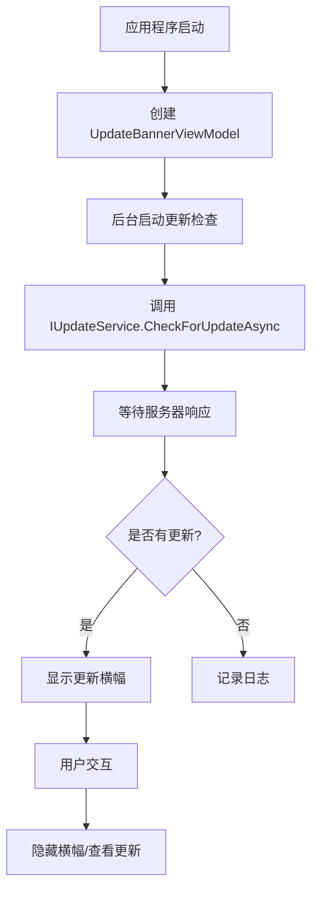
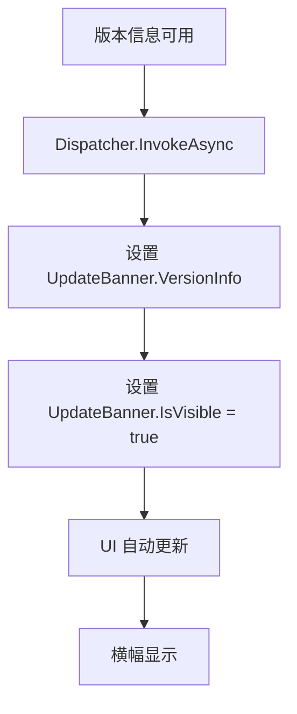
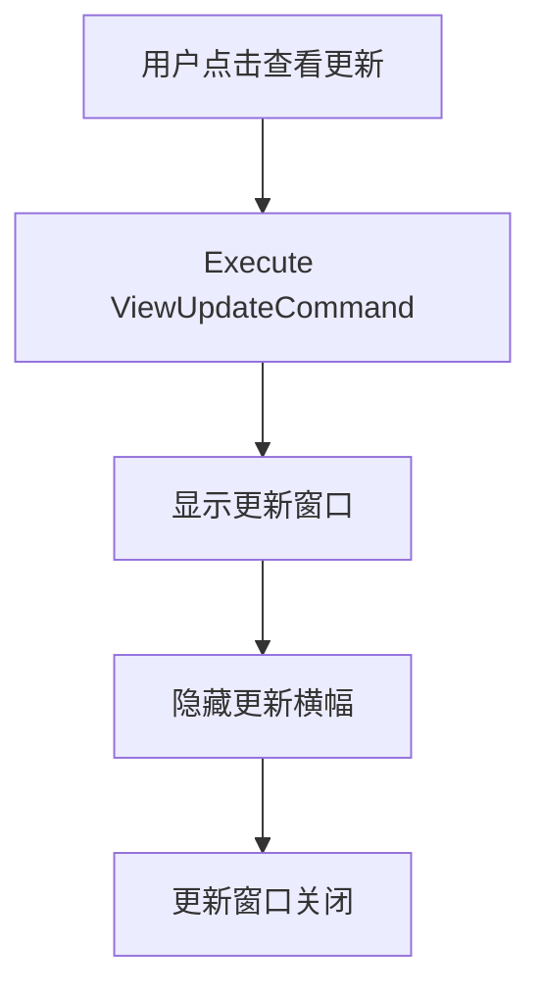

# 更新客户端集成设计文档

> **For Claude:** REQUIRED SUB-SKILL: Use superpowers:executing-plans to implement this plan task-by-task.

**Goal:** 设计并实现 DocuFiller 的外部更新客户端集成功能

**Architecture:** 采用松耦合的架构设计，通过依赖注入集成更新通知系统，确保主应用程序与更新逻辑分离

**Tech Stack:** WPF, MVVM, .NET 8, Microsoft.Extensions.DependencyInjection, YAML 配置

---

## 架构决策

### 1. 模块化设计

**决策**: 将更新功能划分为独立的模块，与主应用程序松耦合

**理由**:
- 主应用程序不应依赖特定的更新实现
- 更新客户端可独立更新和替换
- 便于测试和维护
- 支持多种更新策略（自动/手动）

**实现**:
```
DocuFiller.Core/
├── ViewModels/
│   ├── Update/
│   │   └── UpdateBannerViewModel.cs  // 更新横幅逻辑
├── Views/
│   ├── Update/
│   │   └── UpdateBannerView.xaml    // 更新横幅 UI
├── Models/Update/
│   └── VersionInfo.cs              // 版本信息模型
└── External/
    ├── update-client.exe           // 外部更新客户端
    └── update-config.yaml          // 配置文件
```

### 2. MVVM 模式

**决策**: 严格遵循 MVVM 模式实现更新通知系统

**理由**:
- 保持与现有架构一致性
- 便于单元测试
- 支持数据绑定和命令模式
- 分离 UI 和业务逻辑

**组件关系**:
```
View (UpdateBannerView.xaml)
    ↓ DataContext
ViewModel (UpdateBannerViewModel)
    ↑ Commands
View (MainWindow.xaml)
    ↓ DataContext
ViewModel (MainWindowViewModel) - UpdateBanner 属性
```

### 3. 异步架构

**决策**: 使用异步编程模型处理更新检查

**理由**:
- 避免阻塞 UI 线程
- 支持网络超时和重试机制
- 提高应用程序响应性能

**实现模式**:
```csharp
// 启动时异步检查
Task.Run(async () => await CheckForUpdatesAsync());

// UI 线程安全更新
await Application.Current.Dispatcher.InvokeAsync(() => {
    UpdateBanner.VersionInfo = versionInfo;
    UpdateBanner.IsVisible = true;
});
```

### 4. 依赖注入

**决策**: 使用 Microsoft.Extensions.DependencyInjection 管理服务生命周期

**理由**:
- 解耦组件依赖
- 便于测试和模拟
- 支持生命周期管理

**注册配置**:
```csharp
// App.xaml.cs
services.AddTransient<ViewModels.Update.UpdateBannerViewModel>();
services.AddTransient<Views.Update.UpdateBannerView>();
```

## 组件概述

### 1. UpdateBannerViewModel

**职责**:
- 管理更新通知状态
- 处理用户交互命令
- 实现 INotifyPropertyChanged 接口

**关键特性**:
```csharp
public class UpdateBannerViewModel : INotifyPropertyChanged
{
    public VersionInfo? VersionInfo { get; set; }
    public bool IsVisible { get; set; }
    public string DisplayVersion => VersionInfo?.Version ?? string.Empty;
    public string DisplayMessage => VersionInfo != null ?
        $"发现新版本 {VersionInfo.Version}，请点击查看详情" : "发现可用更新";
    public bool ShowUpdateButton => VersionInfo != null;

    public ICommand HideCommand { get; private set; }
    public ICommand ViewUpdateCommand { get; private set; }
}
```

### 2. UpdateBannerView

**职责**:
- 显示更新通知横幅
- 处理用户界面交互
- 实现拖拽功能

**设计特点**:
- 无边框窗口设计
- 透明背景支持
- 自动定位到右上角
- 现代化 UI 样式

### 3. MainWindowViewModel 集成

**集成点**:
- 在构造函数中初始化 UpdateBanner
- 应用程序启动时自动检查更新
- 处理更新结果显示

**实现逻辑**:
```csharp
public UpdateBannerViewModel? UpdateBanner { get; private set; }

// 启动时检查更新
Task.Run(async () => await OnInitializedAsync());

private async Task CheckForUpdatesAsync(bool isAutoCheck = false)
{
    // 检查逻辑
    var versionInfo = await _updateService.CheckForUpdateAsync(currentVersion, channel);

    if (versionInfo != null)
    {
        await ShowUpdateBannerAsync(versionInfo);
    }
}
```

### 4. 外部更新客户端

**职责**:
- 独立的更新检查服务
- 处理网络通信
- 管理配置文件

**配置格式**:
```yaml
server:
  url: "https://update.example.com/api"
  timeout: 30
app:
  id: "docu-filler"
  current_version: "1.0.0"
check:
  auto_check: true
  interval: 86400
```

## 数据流

### 1. 更新检查流程



### 2. UI 更新流程



### 3. 事件处理流程



## 错误处理

### 1. 网络错误

**处理策略**:
- 捕获 HttpRequestException
- 记录错误日志
- 不显示错误对话框（自动检查时）
- 手动检查时显示友好错误

```csharp
catch (HttpRequestException ex)
{
    _logger.LogError(ex, "网络请求失败");
    if (!isAutoCheck)
    {
        MessageBox.Show("网络连接失败，请检查网络设置", "错误",
            MessageBoxButton.OK, MessageBoxImage.Error);
    }
}
```

### 2. 配置错误

**处理策略**:
- 验证 YAML 配置文件格式
- 提供默认配置值
- 记录配置错误日志

### 3. UI 线程错误

**处理策略**:
- 使用 Dispatcher.InvokeAsync 确保 UI 线程安全
- 捕获并记录 Dispatcher 异常
- 提供降级处理

```csharp
try
{
    await Application.Current.Dispatcher.InvokeAsync(() =>
    {
        UpdateBanner.VersionInfo = versionInfo;
        UpdateBanner.IsVisible = true;
    });
}
catch (Exception ex)
{
    _logger.LogError(ex, "UI 更新失败");
}
```

### 4. 并发访问

**处理策略**:
- 使用 CancellationToken 取消长时间运行的任务
- 避免并发访问共享资源
- 确保线程安全的数据绑定

## 性能考虑

### 1. 启动性能

**优化措施**:
- 延迟 2 秒后执行更新检查
- 在后台线程执行网络请求
- 不阻塞应用程序启动

```csharp
await Task.Delay(2000); // 延迟检查
```

### 2. 内存使用

**优化措施**:
- 使用轻量级的 View 模型
- 及时释放不再需要的资源
- 避免内存泄漏

### 3. 网络效率

**优化措施**:
- 设置合理的超时时间（30秒）
- 支持缓存机制
- 最小化网络请求

## 测试策略

### 1. 单元测试

**测试重点**:
- UpdateBannerViewModel 属性变更通知
- 命令执行逻辑
- 数据绑定验证

```csharp
[Test]
public void VersionInfo_Changed_ShouldRaisePropertyChanged()
{
    var viewModel = new UpdateBannerViewModel(mockLogger.Object);
    var eventMonitor = new PropertyChangedMonitor(viewModel);

    viewModel.VersionInfo = new VersionInfo { Version = "2.0.0" };

    eventMonitor.ShouldRaise(nameof(UpdateBannerViewModel.DisplayVersion));
}
```

### 2. 集成测试

**测试重点**:
- 主窗口集成测试
- 更新横幅显示测试
- 事件处理验证

### 3. 端到端测试

**测试场景**:
- 应用程序启动流程
- 更新检查完整流程
- 用户交互响应

## 安全考虑

### 1. 输入验证

**验证措施**:
- 验证版本号格式
- 验证 URL 格式
- 防止注入攻击

### 2. 权限管理

**权限控制**:
- 最小权限原则
- 文件系统访问限制
- 网络访问控制

### 3. 数据安全

**安全措施**:
- 加密敏感配置
- 安全的网络通信
- 防止中间人攻击

## 扩展性设计

### 1. 插件架构

**扩展点**:
- 更新提供者接口
- 通知方式可扩展
- 配置验证可扩展

### 2. 多渠道支持

**支持渠道**:
- Stable 渠道
- Beta 渠道
- Dev 渠道

### 3. 国际化支持

**本地化考虑**:
- 资源文件分离
- 多语言支持
- 地区特定的更新策略

## 监控和日志

### 1. 日志记录

**日志内容**:
- 更新检查时间
- 服务器响应状态
- 错误详情
- 用户操作记录

**日志级别**:
- Information: 正常操作
- Warning: 可恢复错误
- Error: 严重错误

### 2. 性能监控

**监控指标**:
- 更新检查耗时
- 网络响应时间
- UI 更新延迟

### 3. 错误监控

**监控策略**:
- 错误率统计
- 自动恢复机制
- 告警阈值设置

## 部署和发布

### 1. 构建配置

**构建选项**:
- 发布时包含外部文件
- 配置文件验证
- 版本号自动更新

### 2. 安装程序

**集成考虑**:
- 注册表设置
- 快捷方式创建
- 服务配置

### 3. 更新部署

**部署策略**:
- 增量更新支持
- 回滚机制
- 更新包验证

## 结论

本设计文档详细阐述了 DocuFiller 更新客户端的架构设计、组件关系、数据流和错误处理策略。通过模块化、MVVM 模式和异步编程，实现了一个松耦合、可维护且用户友好的更新通知系统。设计充分考虑了性能、安全、扩展性和可测试性，为后续的功能扩展和维护提供了坚实的基础。