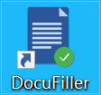
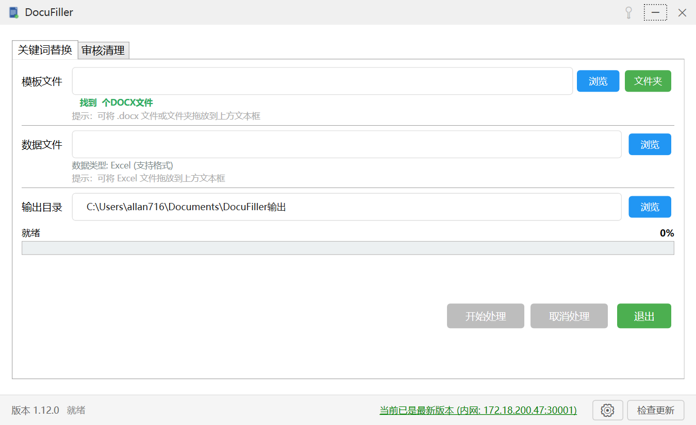
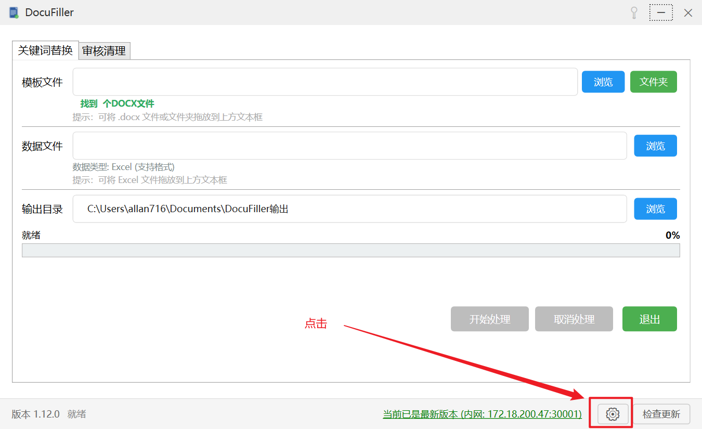
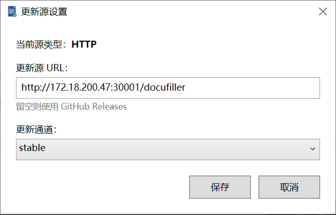
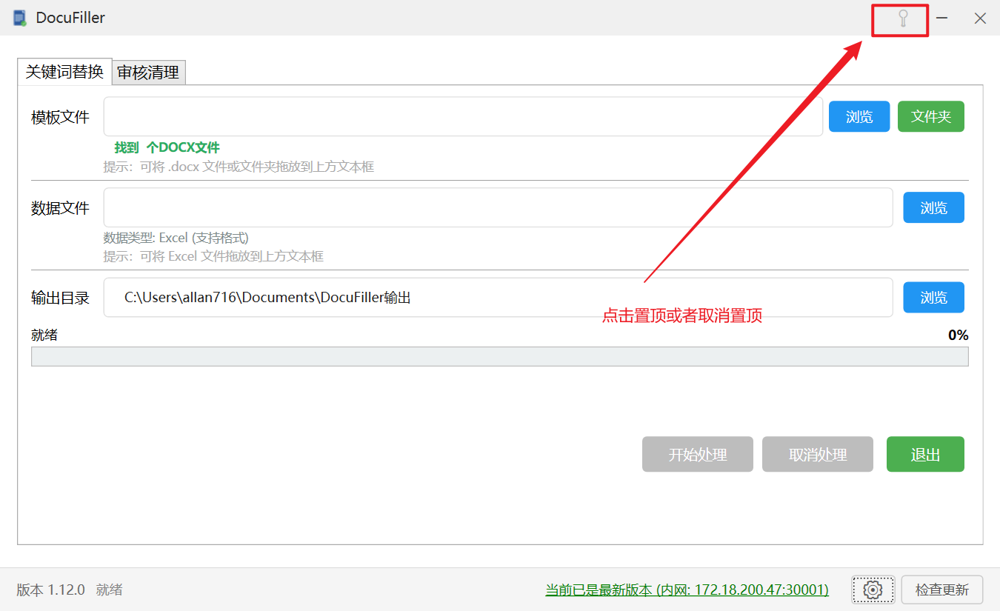
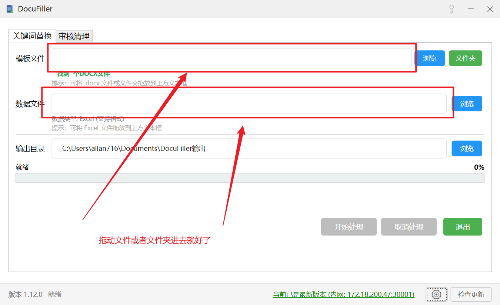

# 注册资料模板替换工具使用说明 V1.0

2026年5月16日

## 0x00 如何安装

系统要求：Windows 10 以上

双击安装程序：`DocuFiller-win-Setup.exe`

安装程序引导如何安装，如果系统缺少支持环境，会提示去下载安装 .Net 支持环境，安装后即可正常使用。

桌面会出现这个安装好的程序快捷图标：

## 0x01 如何设置内网自动检查更新

启动程序，会看到一下界面：

配置内网自动更新服务器：

然后填写入下面的地址：

`http://172.18.200.47:30001/docufiller`

保存。

以后软件启动后，会在 5s 后进行自动的内网版本更新检测，如果有，可以考虑点击更新。如果没有明确的问题，也可以不更新。

## 0x03 软件如何设置置顶显示

可能用户在使用的时候会遇到需要来回切换本工具和文档以及文档文件夹的操作，本软件可以设置置顶，则可以更好的进行交互。

## 0x04 如何添加模板文档和模板文件夹

